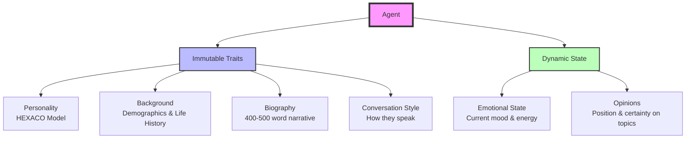
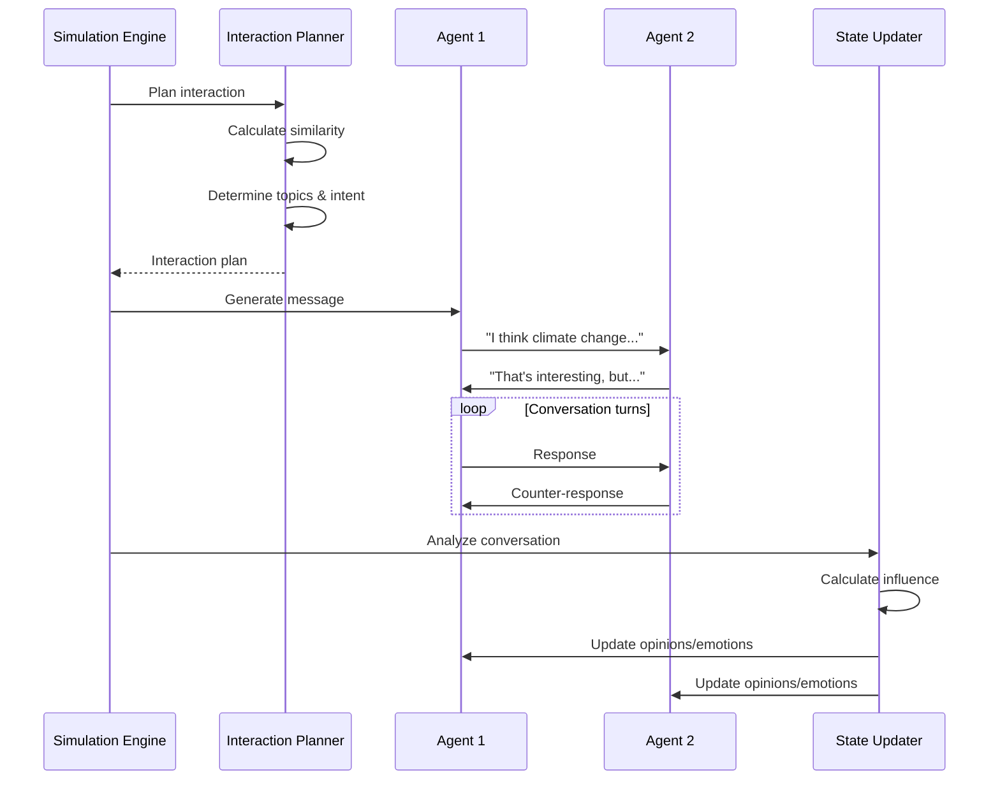
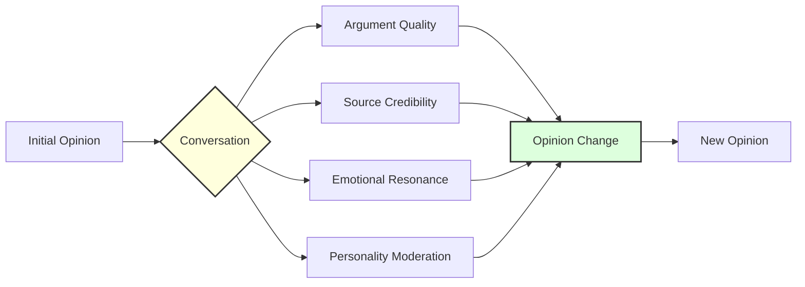
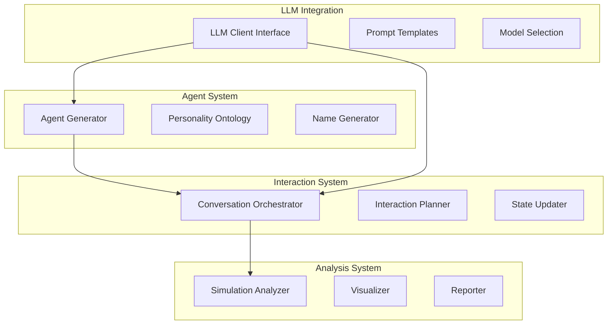
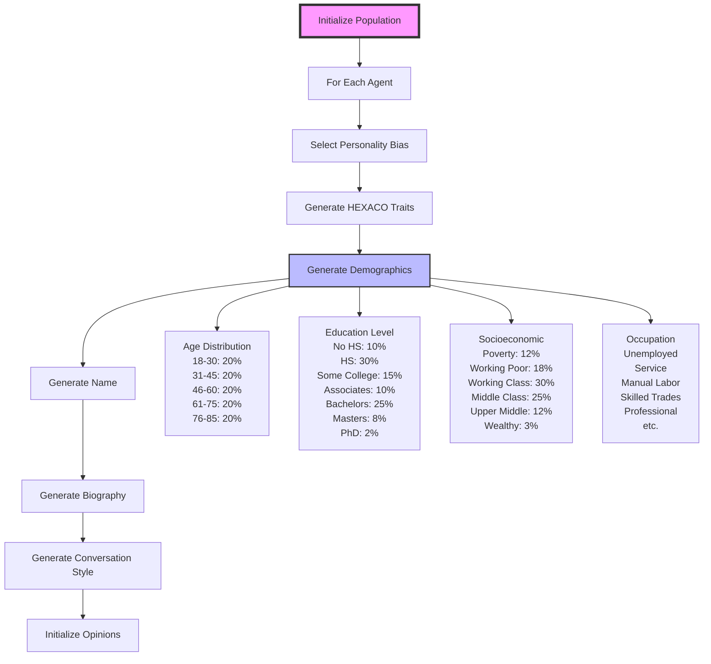
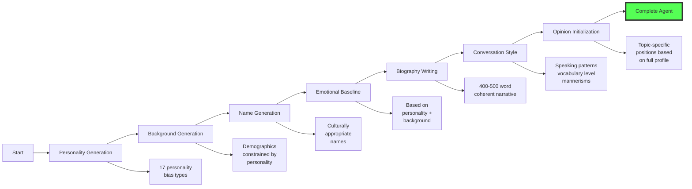

# DynaVox: Agent-Based Social Dynamics Modeling Framework

## Table of Contents

- [Project Overview](#project-overview)
- [Quick Start](#quick-start)
  - [Installation](#installation)
  - [Running Your First Simulation](#running-your-first-simulation)
- [Understanding the Results](#understanding-the-results)
  - [Generated Artifacts](#generated-artifacts)
  - [Visualization Examples](#visualization-examples)
- [Model Architecture](#model-architecture)
  - [Agent Design](#agent-design)
  - [Conversation Flow](#conversation-flow)
  - [Opinion Evolution](#opinion-evolution)
- [Implementation Details](#implementation-details)
  - [Core Components](#core-components)
  - [Personality Model](#personality-model)
  - [Interaction Mechanics](#interaction-mechanics)
- [Advanced Configuration](#advanced-configuration)
  - [Custom Simulations](#custom-simulations)
  - [Model Selection](#model-selection)
  - [Parameter Tuning](#parameter-tuning)
- [API Reference](#api-reference)

## Project Overview

Ever wondered how opinions spread and evolve in social networks? DynaVox is a cutting-edge framework that simulates realistic social interactions using Large Language Models (LLMs) to power psychologically consistent agents. Unlike traditional agent-based models with simplistic rules, our agents have rich personalities, detailed backgrounds, and engage in natural conversations that genuinely influence their beliefs.

**Key Features:**
- 🧠 **Psychology-Driven Agents**: Each agent has a complete HEXACO personality profile, demographic background, and emotional state
- 💬 **Natural Conversations**: Agents engage in realistic dialogues powered by GPT-4, Claude, or other LLMs
- 📊 **Rich Analytics**: Track opinion polarization, consensus formation, and social influence patterns
- 🎨 **Beautiful Visualizations**: Auto-generated dashboards showing opinion evolution and social dynamics
- ⚡ **Easy to Use**: Get started with just 3 lines of code!

## Quick Start

### Installation

```bash
# Clone the repository
git clone https://github.com/yourusername/DynaVox.git
cd DynaVox

# Create a virtual environment (recommended)
python -m venv venv
source venv/bin/activate  # On Windows: venv\Scripts\activate

# Install the package
pip install -e .

# Set up your API keys (create a .env file)
echo "OPENAI_API_KEY=your-key-here" > .env
echo "ANTHROPIC_API_KEY=your-key-here" >> .env
```

### Running Your First Simulation

The simplest way to run a simulation takes just 3 lines of code:

```python
from src import QuickSimulation

# Create and run simulation
sim = QuickSimulation()
results = sim.quick_run('test')  # 5 agents, 3 rounds - perfect for testing!
```

That's it! Your simulation will:
1. Generate 5 unique agents with rich personalities and backgrounds
2. Have them discuss topics like climate change and AI regulation
3. Track how their opinions evolve through conversation
4. Generate comprehensive visualizations and reports

## Understanding the Results

### Generated Artifacts

After running a simulation, you'll find a timestamped folder in `results/` containing:

```
results/2024-05-26_10-30-45_test/
├── data/                    # Raw simulation data
│   ├── agents.json         # Complete agent profiles
│   ├── conversations.json  # Full conversation transcripts
│   ├── metrics_history.json # Population metrics over time
│   └── analysis.json       # Detailed analysis results
├── visualizations/         # All generated plots
│   ├── summary_dashboard.png    # Main overview dashboard
│   ├── opinion_evolution.png    # Opinion trajectories
│   ├── polarization_trends.png  # Polarization over time
│   └── social_network.png       # Interaction network
└── reports/               # Human-readable reports
    ├── simulation_report.md     # Comprehensive markdown report
    ├── agent_summaries.csv      # Agent data in spreadsheet format
    └── summary.json             # Key findings summary
```

### Visualization Examples

The framework generates several types of visualizations automatically:

**Summary Dashboard** - A comprehensive overview showing:
- Opinion distributions across topics
- Population-level metrics (polarization, consensus)
- Agent interaction patterns
- Emotional state evolution

**Opinion Evolution** - Track how individual opinions change:
- Each line represents an agent's opinion trajectory
- Colors indicate different topics
- Thickness shows certainty levels

## Model Architecture

### Agent Design



Each agent is a complete individual with:

**Immutable Traits** (don't change during simulation):
- **Personality**: Based on the HEXACO model (6 dimensions, each 0-100)
- **Background**: Age, occupation, education, cultural factors
- **Biography**: A coherent life story that explains their personality
- **Conversation Style**: How they speak based on their background

**Dynamic State** (evolves through interaction):
- **Emotional State**: Current mood, anxiety, social energy
- **Opinions**: Multi-dimensional views on various topics

### Conversation Flow



### Opinion Evolution

Opinions change based on multiple factors:



## Implementation Details

### Core Components

The framework consists of several key modules:



### Personality Model

We use the HEXACO model with 5 behavioral bands per trait:

| Trait | Very Low (0-20) | Low (21-40) | Medium (41-60) | High (61-80) | Very High (81-100) |
|-------|-----------------|-------------|----------------|--------------|-------------------|
| **Honesty-Humility** | Manipulative | Strategic | Balanced | Sincere | Self-deprecating |
| **Emotionality** | Detached | Stable | Moderate | Sensitive | Overwhelmed |
| **Extraversion** | Avoidant | Reserved | Balanced | Social | Compulsive |
| **Agreeableness** | Confrontational | Direct | Diplomatic | Cooperative | Over-accommodating |
| **Conscientiousness** | Chaotic | Flexible | Organized | Diligent | Rigid |
| **Openness** | Closed-minded | Traditional | Balanced | Curious | Obsessed with novelty |

### Interaction Mechanics

**Homophily** determines interaction probability:
```python
# Agents more likely to interact if similar
similarity = weighted_sum(
    personality_similarity * 0.3,
    background_similarity * 0.3,
    opinion_similarity * 0.4
)
interaction_probability = base_prob * (1 + homophily_bias * similarity)
```

**Opinion Influence** is moderated by personality:
```python
# High openness = more receptive to new ideas
# High conscientiousness = needs strong evidence
# High agreeableness = influenced by social harmony
influence = argument_quality * personality_moderation * emotional_impact
```

## Advanced Configuration

### Agent Population Initialization

The framework now supports highly diverse agent populations with realistic demographics:



### Individual Agent Creation Flow

Each agent is created through a sophisticated multi-step process:



### Running Advanced Simulations

```python
from src.simulation.engine import SimulationEngine
from src.llm import create_llm_client
from src.config import AGENT_GENERATION_PARAMS

# Custom demographics distribution
custom_demographics = {
    'min_age': 25,
    'max_age': 65,
    'education_distribution': {
        'high_school': 0.4,
        'bachelors': 0.4,
        'masters': 0.15,
        'phd': 0.05
    }
}

# Initialize with custom parameters
llm_client = create_llm_client(model='gpt-4o-mini')
engine = SimulationEngine(llm_client, use_async=True)

# Generate diverse population
engine.initialize_population(
    size=100,
    topics=['climate_change', 'wealth_inequality', 'ai_regulation', 'immigration'],
    demographics=custom_demographics,
    personality_distribution={
        'analytical': 0.2,
        'emotional': 0.2,
        'balanced': 0.3,
        'contrarian': 0.15,
        'follower': 0.15
    }
)

# Run with custom interaction parameters
engine.run_simulation(
    rounds=30,
    interaction_probability=0.2,  # Higher interaction rate
    homophily_bias=0.4,          # Lower bias = more diverse interactions
    max_interactions_per_agent=3  # More conversations per round
)
```

### Personality Bias Types

The framework now supports 17 different personality bias types for population diversity:

| Bias Type | Description | Typical Traits |
|-----------|-------------|----------------|
| `high_openness` | Creative, curious | O: 70-90, C: 40-60 |
| `high_conscientiousness` | Organized, diligent | C: 70-90, O: 50-70 |
| `high_agreeableness` | Cooperative, trusting | A: 70-90, H: 60-80 |
| `high_extraversion` | Social, energetic | E: 70-90, Em: 30-50 |
| `high_emotionality` | Sensitive, anxious | Em: 70-90, E: 30-50 |
| `high_honesty_humility` | Modest, sincere | H: 70-90, A: 60-80 |
| `low_agreeableness` | Critical, competitive | A: 20-40, H: 30-50 |
| `low_openness` | Traditional, practical | O: 20-40, C: 60-80 |
| `low_conscientiousness` | Flexible, spontaneous | C: 20-40, O: 50-70 |
| `low_extraversion` | Reserved, quiet | E: 20-40, C: 60-80 |
| `low_honesty_humility` | Ambitious, confident | H: 20-40, E: 60-80 |
| `balanced` | Moderate all traits | All: 40-60 |
| `mixed_introverted` | Thoughtful, focused | E: 20-40, C: 60-80, O: 50-70 |
| `mixed_creative` | Artistic, unconventional | O: 70-90, C: 30-50, A: 40-60 |
| `mixed_anxious` | Worried, careful | Em: 70-90, E: 20-40, C: 60-80 |
| `mixed_leader` | Assertive, organized | E: 70-90, C: 70-90, H: 40-60 |
| `mixed_rebel` | Independent, challenging | A: 20-40, O: 70-90, C: 30-50 |

### Occupation Categories

Agents can now have diverse occupations across 11 categories:

```python
OCCUPATION_CATEGORIES = {
    'unemployed': ['Unemployed', 'Between jobs', 'Job searching'],
    'service': ['Cashier', 'Retail worker', 'Food service worker', 'Janitor'],
    'manual_labor': ['Construction worker', 'Factory worker', 'Warehouse worker'],
    'clerical': ['Administrative assistant', 'Data entry clerk', 'Receptionist'],
    'skilled_trades': ['Carpenter', 'Welder', 'Electrician', 'Plumber'],
    'education': ['Teacher', 'School counselor', 'Librarian', 'Tutor'],
    'healthcare': ['Nurse', 'Medical assistant', 'EMT', 'Physical therapist'],
    'business': ['Manager', 'Accountant', 'HR specialist', 'Sales rep'],
    'professional': ['Engineer', 'Doctor', 'Lawyer', 'Architect'],
    'creative': ['Designer', 'Writer', 'Musician', 'Artist'],
    'public_service': ['Police officer', 'Firefighter', 'Social worker']
}
```

### Fine-Tuning Interaction Dynamics

Control how agents interact with detailed parameters:

```python
# Interaction probability modifiers
interaction_params = {
    # Base probability that any two agents will interact
    'base_probability': 0.15,
    
    # How much similarity affects interaction probability
    'homophily_bias': 0.6,  # 0 = random, 1 = only similar agents
    
    # Personality-based modifiers
    'extraversion_boost': 0.2,  # Extraverts more likely to interact
    'energy_threshold': 20,      # Min social energy needed
    
    # Topic selection
    'disagreement_bonus': 1.2,   # Prefer controversial topics
    'importance_weight': 1.5,    # Prefer important topics
    'knowledge_threshold': 30    # Min knowledge to discuss topic
}

# Opinion change parameters
opinion_params = {
    'base_influence_rate': 0.1,      # Maximum opinion shift per conversation
    'certainty_resistance': 0.8,     # How certainty resists change
    'personality_moderation': {
        'openness_factor': 1.2,      # High openness = more receptive
        'conscientiousness_factor': 0.8,  # High C = needs evidence
        'agreeableness_factor': 1.1   # High A = influenced by harmony
    }
}
```

### Analyzing Results Programmatically

```python
# After simulation completes
from src.analysis import SimulationAnalyzer

analyzer = SimulationAnalyzer()
metrics = analyzer.calculate_population_metrics(
    engine.agents, 
    engine.conversations, 
    engine.round_number
)

# Access detailed metrics
print(f"Overall polarization: {metrics.overall_polarization}")
print(f"Echo chambers detected: {len(metrics.echo_chambers)}")
print(f"Most influential agents: {metrics.top_influencers[:5]}")

# Topic-specific analysis
for topic, topic_metrics in metrics.opinion_metrics.items():
    print(f"\n{topic}:")
    print(f"  Mean position: {topic_metrics['mean_position']}")
    print(f"  Std deviation: {topic_metrics['std_dev']}")
    print(f"  Clusters: {len(topic_metrics['opinion_clusters'])}")
    
    # Analyze opinion movement
    movements = analyzer.calculate_opinion_movements(
        engine.agents, topic, start_round=0
    )
    print(f"  Agents who changed opinion: {movements['changed_count']}")
    print(f"  Average position shift: {movements['avg_shift']}")
```

### Legacy Configuration Examples

For backward compatibility, the original configuration methods are still supported:

```python
from src import QuickSimulation

# Initialize with specific model
sim = QuickSimulation(model='gpt-4o')

# Run with custom parameters
results = sim.run(
    num_agents=50,
    num_rounds=20,
    topics=['climate_change', 'wealth_inequality', 'ai_regulation'],
    interaction_probability=0.15,  # Base probability of interaction
    homophily_bias=0.7,           # How much similarity matters (0-1)
    personality_distribution={     # Control agent personalities
        'balanced': 0.4,
        'analytical': 0.3,
        'emotional': 0.3
    }
)
```

### Model Selection

Supported LLM providers and models:

| Provider | Models | Cost | Speed | Quality |
|----------|--------|------|-------|---------|
| **OpenAI** | `gpt-4o`, `gpt-4o-mini`, `gpt-3.5-turbo` | $-$$$ | Fast | Excellent |
| **Anthropic** | `claude-3-5-sonnet`, `claude-3-haiku` | $$-$$$ | Medium | Excellent |
| **Mock** | `mock` (for testing) | Free | Instant | N/A |

List available models:
```bash
python example_simulation.py --list-models
```

Estimate costs before running:
```python
from src.llm import estimate_cost

cost = estimate_cost(
    model="gpt-4o-mini",
    num_agents=50,
    num_rounds=20,
    interactions_per_round=25
)
print(f"Estimated cost: ${cost['estimated_cost_usd']:.2f}")
```

### Parameter Tuning

Key parameters that affect simulation dynamics:

```python
# Population parameters
num_agents = 50              # Size of population
personality_distribution = {  # Agent personality mix
    'open_minded': 0.3,
    'traditional': 0.3,
    'balanced': 0.4
}

# Interaction parameters
interaction_probability = 0.15  # Base chance of interaction per pair
max_interactions_per_agent = 2  # Limit per round
conversation_max_turns = 20     # Maximum conversation length
homophily_bias = 0.6           # 0 = random, 1 = only similar agents

# Opinion change parameters
base_influence_rate = 0.1      # How much opinions can change
certainty_threshold = 80       # High certainty resists change
emotional_contagion = 0.3      # How much emotions spread
```

## API Reference

### QuickSimulation

The main entry point for simulations:

```python
class QuickSimulation:
    def __init__(self, model: Optional[str] = None, use_mock: bool = False):
        """Initialize simulation.
        
        Args:
            model: LLM model name (e.g., 'gpt-4o', 'claude-3-5-sonnet')
            use_mock: Use mock LLM for testing without API calls
        """
    
    def run(self, num_agents: int, num_rounds: int, **kwargs) -> Dict:
        """Run custom simulation with specified parameters."""
    
    def quick_run(self, preset: str = 'small') -> Dict:
        """Run simulation with preset configurations.
        
        Presets:
            - 'test': 5 agents, 3 rounds (quick testing)
            - 'small': 20 agents, 10 rounds (default)
            - 'medium': 50 agents, 20 rounds
            - 'large': 100 agents, 30 rounds
        """
```

### Agent

Core agent class with personality and state:

```python
@dataclass
class Agent:
    # Identity
    id: str
    name: str
    
    # Immutable traits
    personality: PersonalityTraits  # HEXACO model
    background: Background          # Demographics
    biography: str                  # Life story
    conversation_style: str         # Speaking patterns
    
    # Dynamic state
    emotional_state: EmotionalState
    opinions: Dict[str, Opinion]
    
    # Methods
    def update_emotional_state(**kwargs)
    def update_opinion(topic: str, **kwargs)
```

### Running from Command Line

You can also run simulations directly from the command line:

```bash
# Run with defaults
python -m src.quick_sim

# Specify model and size
python -m src.quick_sim --model gpt-4o-mini --preset medium

# Custom parameters
python -m src.quick_sim --agents 30 --rounds 15 --output my_results

# Use mock mode for testing
python -m src.quick_sim --mock --preset small
```

---

## Environment Variables

Create a `.env` file in the project root:

```bash
# Required for OpenAI models
OPENAI_API_KEY=sk-...

# Required for Anthropic models
ANTHROPIC_API_KEY=sk-ant-...

# Optional: Default model if not specified
DEFAULT_MODEL=gpt-4o-mini

# Optional: Use mock LLM for testing
USE_MOCK_LLM=false
```

## Contributing

We welcome contributions! Please see our [Contributing Guide](CONTRIBUTING.md) for details.

## Citation

If you use DynaVox in your research, please cite:

```bibtex
@software{opiniondynamics2024,
  title = {DynaVox: LLM-Powered Agent-Based Social Dynamics Modeling},
  author = {Your Name},
  year = {2024},
  url = {https://github.com/yourusername/DynaVox}
}
```

## Logging Configuration

DynaVox includes comprehensive logging capabilities for debugging and monitoring simulations.

### Log Levels

- **DEBUG**: Detailed information for diagnosing problems
- **INFO**: General informational messages (default)
- **WARNING**: Warning messages about potential issues  
- **ERROR**: Error messages when something goes wrong
- **CRITICAL**: Critical messages for severe failures

### Setting Log Level

```bash
# Default INFO level
python examples/example_simulation.py

# Debug level for detailed output
python examples/example_simulation.py --log-level DEBUG

# Only warnings and errors
python examples/example_simulation.py --log-level WARNING
```

### Log Files

- `simulation.log` - Complete log with all messages
- `simulation_rotating.log` - LLM-specific logs with rotation (max 10MB, 5 backups)

### What Gets Logged

**Simulation Level:**
- Population initialization
- Round start/end
- Interaction decisions and outcomes
- Metrics calculation

**Agent Level:**
- Agent creation with demographics
- Personality generation
- State updates

**Conversation Level:**
- Planning and topic selection
- Turn-by-turn dialogue
- Opinion and emotional changes

**DEBUG Mode Example:**
```
DEBUG - Calculating similarity between John Smith and Jane Doe
DEBUG - honesty_humility: 65 vs 72, diff=0.070
DEBUG - emotionality: 45 vs 58, diff=0.130
DEBUG - Total similarity: 0.683
```

## Quick Start Examples

### The Simplest Simulation (3 lines!)

```python
from src import QuickSimulation

sim = QuickSimulation()  # Automatically loads settings from .env
results = sim.quick_run('small')  # Run simulation and generate all outputs!
```

### Command Line Usage

```bash
# Quick test run (5 agents, 3 rounds)
python -m src.quick_sim --preset test

# Small simulation (20 agents, 10 rounds) 
python -m src.quick_sim --preset small

# With specific model
python -m src.quick_sim --model gpt-3.5-turbo --preset medium

# Custom parameters
python -m src.quick_sim --agents 30 --rounds 15 --model claude-3-5-haiku

# Mock mode (no API calls)
python -m src.quick_sim --mock --preset test
```

### Simulation Presets

| Preset | Agents | Rounds | Use Case | Runtime |
|--------|--------|--------|----------|---------|
| `test` | 5 | 3 | Quick testing | ~1 min |
| `small` | 20 | 10 | Default, demos | ~5 min |
| `medium` | 50 | 20 | Detailed analysis | ~15 min |
| `large` | 100 | 30 | Research studies | ~30+ min |

### Cost Estimates

Rough estimates per simulation (prices as of Dec 2024):

| Model | Small (20 agents) | Medium (50 agents) | Large (100 agents) |
|-------|-------------------|-------------------|---------------------|
| GPT-4o-mini | ~$0.10 | ~$0.50 | ~$2.00 |
| GPT-3.5-turbo | ~$0.05 | ~$0.25 | ~$1.00 |
| GPT-4o | ~$0.50 | ~$2.50 | ~$10.00 |
| Claude-3.5-Haiku | ~$0.08 | ~$0.40 | ~$1.60 |

### Tips for Best Results

1. **Start small**: Use `test` or `small` presets first
2. **Use mock mode**: Test your setup without API calls
3. **Budget-friendly**: `gpt-4o-mini` or `claude-3-5-haiku` offer great value
4. **Check dashboard first**: `summary_dashboard.png` gives you the big picture
5. **Read the report**: `simulation_report.md` has detailed insights

## License

This project is licensed under the MIT License - see the [LICENSE](LICENSE) file for details.