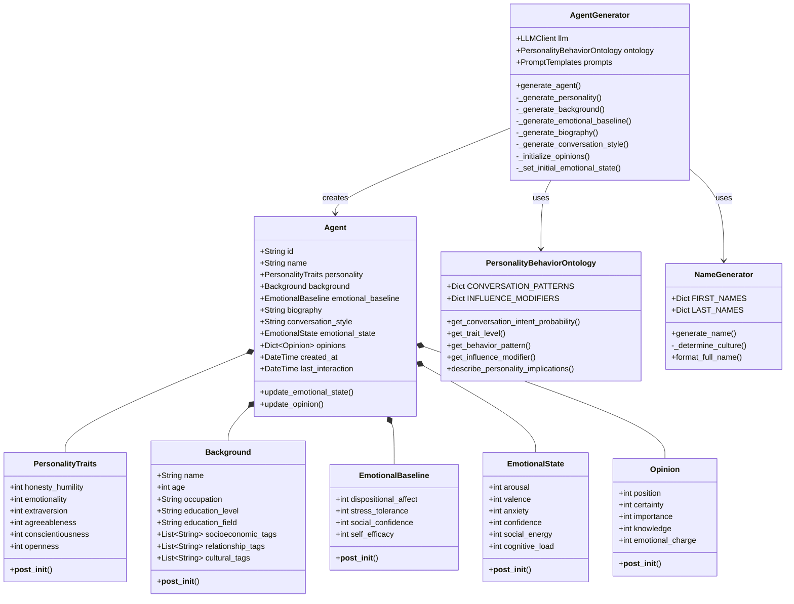
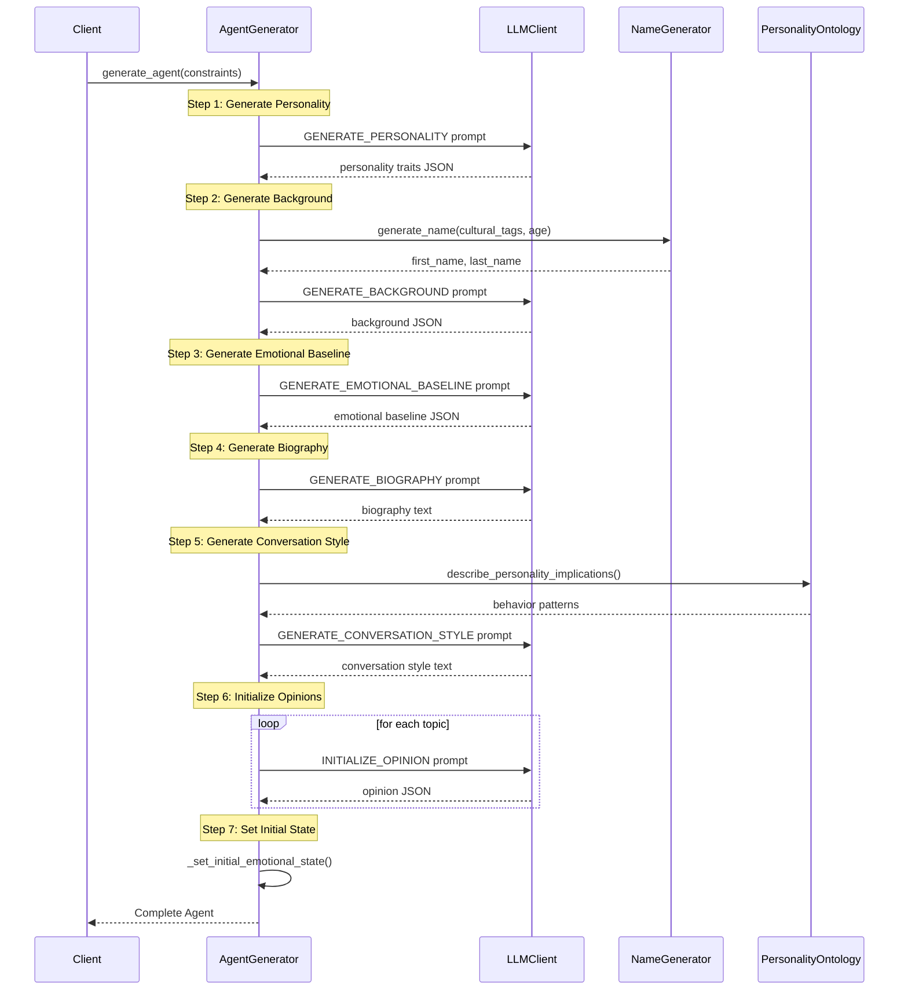
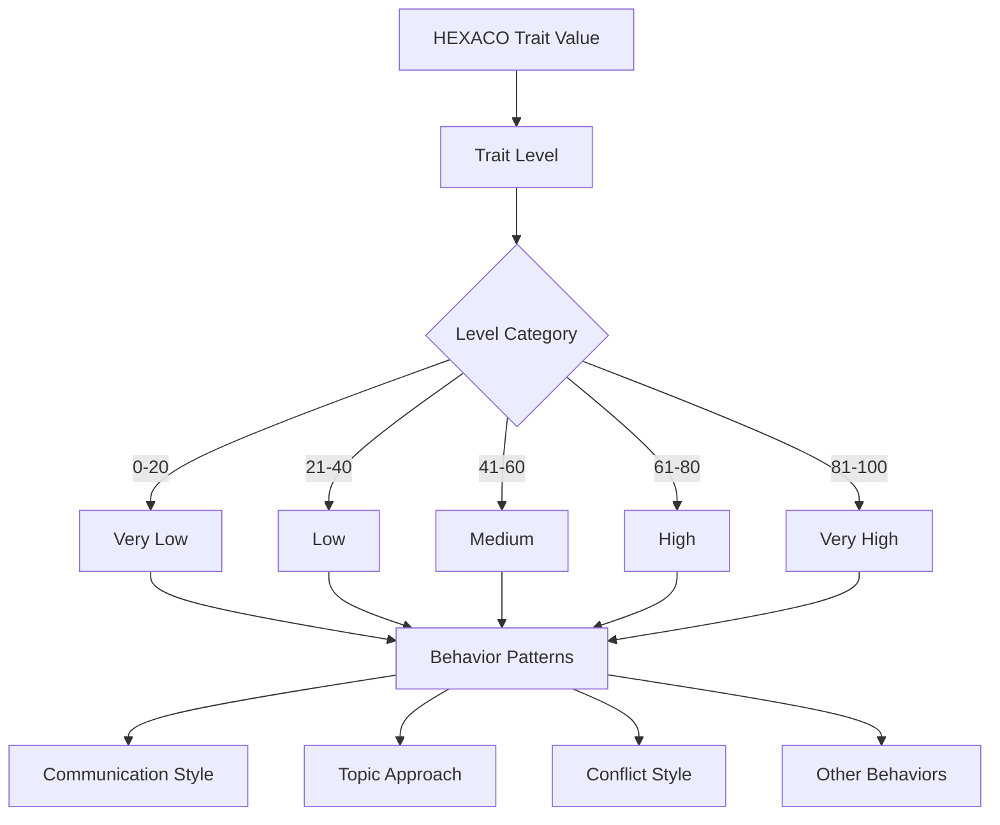
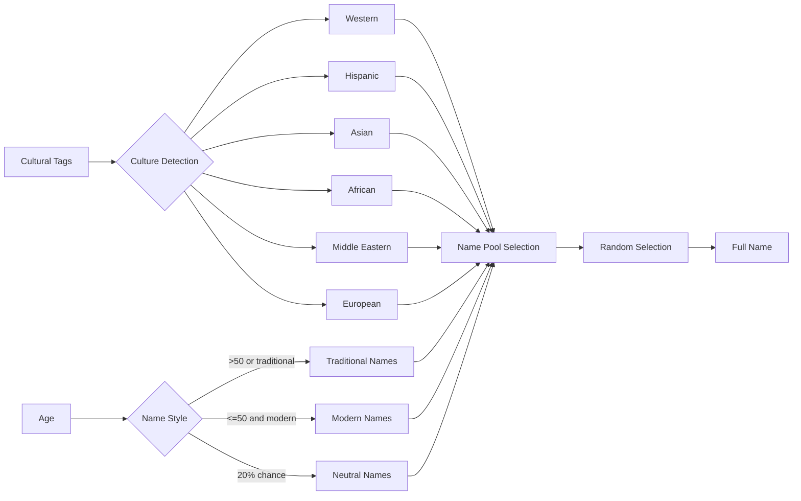
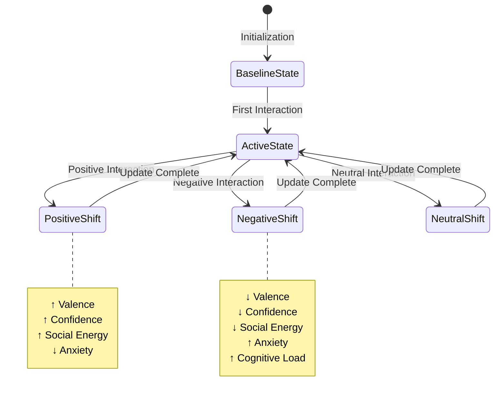

# Agents Module Documentation

## Overview

The agents module defines the core data structures and generation logic for creating psychologically complex agents in the DynaVox framework. It implements a comprehensive agent model based on the HEXACO personality framework, with dynamic emotional states and opinion systems.

## Module Structure



## Agent Generation Process

The agent generation follows a structured 7-step process:



## Core Components

### 1. Profile Data Structures (`profile.py`)

#### PersonalityTraits
- Implements the HEXACO model with 6 dimensions (0-100 scale)
- Validated on initialization to ensure values are within bounds
- Serves as the immutable core of agent psychology

#### Background
- Contains demographic information (age, occupation, education)
- Uses tag-based system for flexibility:
  - `socioeconomic_tags`: e.g., ["middle-class", "suburban"]
  - `relationship_tags`: e.g., ["married", "parent-of-two"]
  - `cultural_tags`: e.g., ["progressive", "secular"]

#### EmotionalBaseline
- Represents stable emotional tendencies
- `dispositional_affect`: General mood (-50 to +50)
- `stress_tolerance`: Resilience (0-100)
- `social_confidence`: Social comfort (0-100)
- `self_efficacy`: Self-belief (0-100)

#### EmotionalState
- Dynamic emotional variables that change during simulation
- Includes arousal, valence, anxiety, confidence, social_energy, cognitive_load
- Updated after each interaction

#### Opinion
- Multi-dimensional opinion representation:
  - `position`: Stance on topic (-100 to +100)
  - `certainty`: Confidence in position (0-100)
  - `importance`: Personal relevance (0-100)
  - `knowledge`: Perceived expertise (0-100)
  - `emotional_charge`: Emotional investment (0-100)

### 2. Personality-Behavior Ontology (`personality.py`)

The `PersonalityBehaviorOntology` class maps HEXACO traits to specific behaviors:



#### Conversation Patterns
Each trait at each level defines:
- **Honesty-Humility**: Communication style, topic approach, conflict style, persuasion ethics
- **Emotionality**: Stress response, empathy expression, vulnerability, decision style
- **Extraversion**: Interaction energy, speaking ratio, topic breadth, social fatigue
- **Agreeableness**: Conflict avoidance, criticism style, cooperation, trust tendency
- **Conscientiousness**: Argument structure, fact-checking, commitment, time awareness
- **Openness**: Idea receptivity, opinion flexibility, curiosity, abstraction level

#### Influence Modifiers
Dynamic functions that calculate how personality affects opinion change:
- Source credibility weight
- Emotional appeal resistance
- Social proof sensitivity
- Evidence requirements
- Novelty bonus
- Certainty flexibility

### 3. Agent Generation (`generator.py`)

The `AgentGenerator` orchestrates the creation of psychologically consistent agents:

#### Generation Constraints
- `personality_bias`: Influences trait generation
- `topics`: Pre-selected opinion topics
- `demographic_constraints`: Age, occupation preferences

#### Generation Steps

1. **Personality Generation**
   - Uses LLM to generate HEXACO traits
   - Ensures psychological consistency
   - Falls back to defaults on failure

2. **Background Generation**
   - Generates culturally appropriate names via `NameGenerator`
   - Creates occupation, education consistent with personality
   - Assigns appropriate demographic tags

3. **Emotional Baseline**
   - Derives from personality and background
   - High emotionality → lower stress tolerance
   - High extraversion → higher social confidence

4. **Biography Generation**
   - 800-1200 word narrative
   - Weaves together all traits coherently
   - Creates life history explaining current state

5. **Conversation Style**
   - Uses personality ontology for behavior patterns
   - Generates specific speech patterns
   - Includes stress responses and listening style

6. **Opinion Initialization**
   - For each topic, generates multi-dimensional opinion
   - Considers personality, background, and biography
   - Ensures consistency across topics

7. **Initial Emotional State**
   - Sets based on emotional baseline
   - Adds slight variations for realism

### 4. Name Generation (`name_generator.py`)

Provides culturally diverse name generation:



#### Cultural Backgrounds
- **Western**: American, British, Canadian, Australian names
- **Hispanic**: Spanish and Latin American names
- **Asian**: Chinese, Japanese, Korean, Indian names
- **African**: Various African regional names
- **Middle Eastern**: Arab, Persian, Turkish names
- **European**: French, German, Italian, Russian names

#### Name Selection Logic
- Age > 50 or "traditional" tag → traditional names
- Otherwise → modern names
- 20% chance to include neutral names for variety
- Some cultures (Asian) may use surname-first format (30% chance)

## State Management

### Emotional State Updates



### Opinion Evolution

Opinions change through a multi-factor process:

1. **Position Changes**: Influenced by argument quality, source credibility, and personality
2. **Certainty Changes**: Increase with validation, decrease with strong counter-arguments
3. **Importance Changes**: Increase with emotional engagement and conflict
4. **Knowledge Updates**: Increase through substantive discussions
5. **Emotional Charge**: Increases with position changes and heated debates

## Usage Example

```python
from src.agents.generator import AgentGenerator
from src.llm.client import OpenAIClient

# Initialize generator
llm_client = OpenAIClient(model="gpt-4")
generator = AgentGenerator(llm_client)

# Generate agent with constraints
constraints = {
    'topics': ['climate_change', 'ai_regulation'],
    'personality_bias': 'intellectual and open-minded',
    'demographic_constraints': {
        'age_range': [25, 45],
        'education_min': 'bachelors'
    }
}

agent = generator.generate_agent(constraints)

# Access agent properties
print(f"Name: {agent.name}")
print(f"Personality: O={agent.personality.openness}, C={agent.personality.conscientiousness}")
print(f"Opinion on climate change: {agent.opinions['climate_change'].position}")
```

## Key Design Principles

1. **Psychological Consistency**: All aspects of an agent (personality, background, opinions) are generated to be mutually consistent

2. **Cultural Sensitivity**: Name generation and background creation respect cultural diversity

3. **Dynamic States**: Clear separation between immutable traits and dynamic states

4. **Multi-dimensional Opinions**: Opinions are not just positions but include certainty, importance, knowledge, and emotional investment

5. **Behavioral Realism**: The personality-behavior ontology provides specific, granular mappings from traits to behaviors

6. **Graceful Degradation**: Fallback mechanisms ensure agent generation succeeds even if LLM calls fail