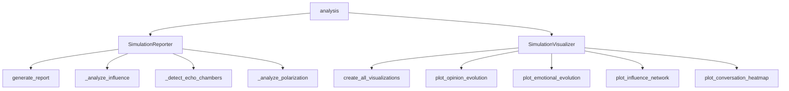
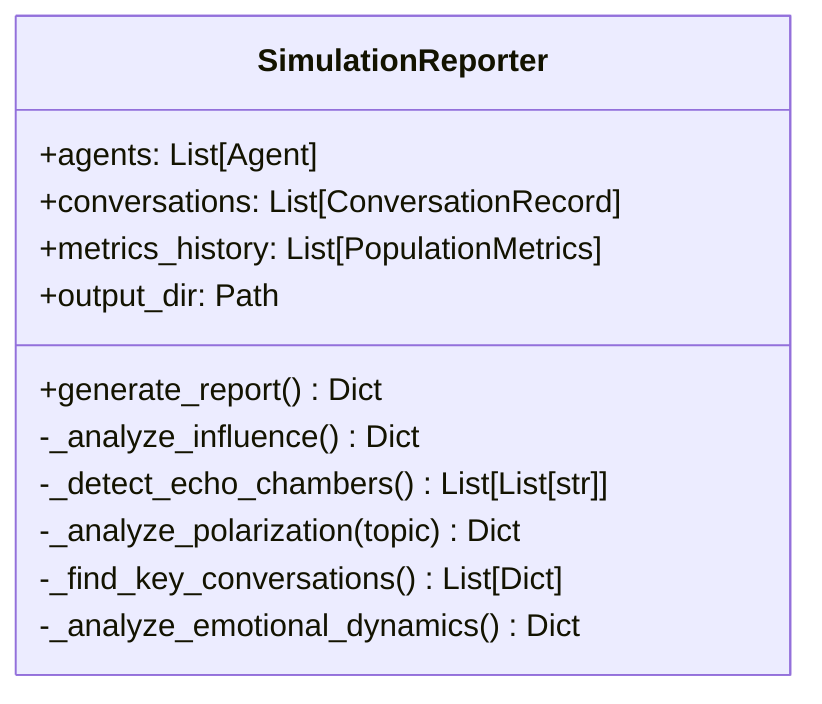
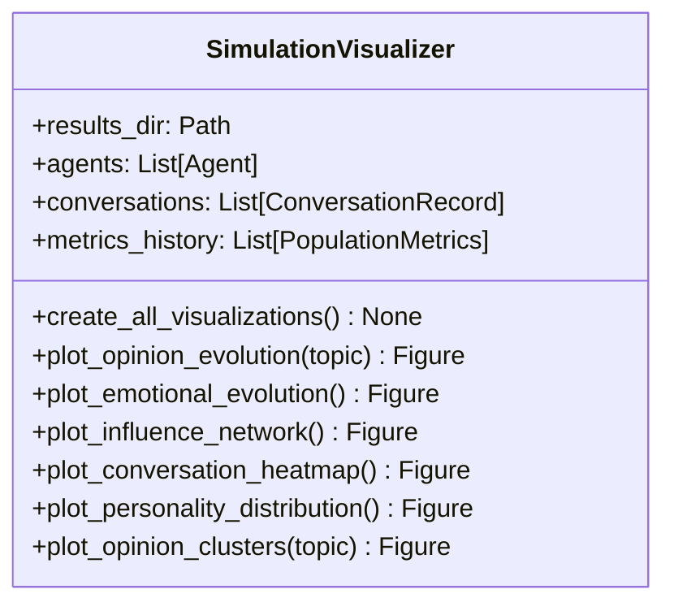
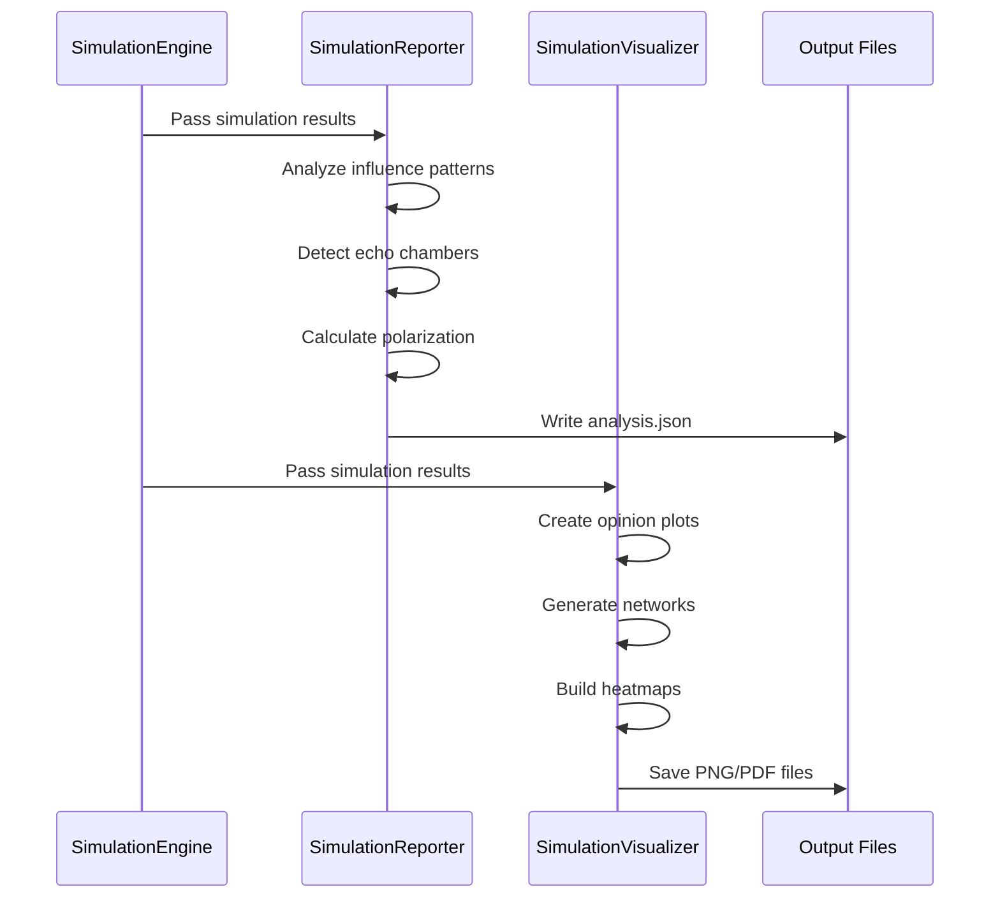

# Analysis Module Documentation

## Overview

The analysis module provides comprehensive tools for analyzing and visualizing simulation results from DynaVox. It includes components for generating detailed reports, creating visualizations, and extracting insights from agent interactions and opinion dynamics.

## Module Structure



## Components

### SimulationReporter

The `SimulationReporter` class generates comprehensive textual reports from simulation results.



#### Key Methods

1. **generate_report()**: Main method that orchestrates all analyses
   - Analyzes influence patterns
   - Detects echo chambers
   - Examines polarization trends
   - Identifies key conversations
   - Generates summary statistics

2. **_analyze_influence()**: Identifies most influential agents
   - Tracks opinion changes caused by each agent
   - Measures consistency of influence
   - Creates influence rankings

3. **_detect_echo_chambers()**: Finds groups with similar opinions
   - Uses clustering algorithms on opinion vectors
   - Identifies stable opinion groups
   - Tracks echo chamber evolution

4. **_analyze_polarization()**: Measures opinion polarization
   - Calculates opinion variance per topic
   - Identifies extreme opinion holders
   - Tracks polarization trends over time

### SimulationVisualizer

The `SimulationVisualizer` class creates visual representations of simulation data.



#### Visualization Types

1. **Opinion Evolution**
   - Time series of opinion positions per topic
   - Shows individual agent trajectories
   - Highlights consensus formation or polarization

2. **Emotional Evolution**
   - Tracks emotional states over time
   - Shows mood, anxiety, confidence trends
   - Correlates with conversation events

3. **Influence Network**
   - Graph visualization of influence relationships
   - Node size represents influence magnitude
   - Edge thickness shows interaction frequency

4. **Conversation Heatmap**
   - Matrix showing interaction patterns
   - Color intensity indicates conversation frequency
   - Reveals social network structure

5. **Personality Distribution**
   - Radar charts for HEXACO traits
   - Population-level trait distributions
   - Personality cluster analysis

6. **Opinion Clusters**
   - 2D projections of opinion space
   - Cluster boundaries and centroids
   - Movement patterns over time

## Data Flow



## Analysis Metrics

### Influence Metrics
- **Direct Influence**: Opinion changes directly caused by an agent
- **Influence Consistency**: How reliably an agent influences others
- **Influence Reach**: Number of unique agents influenced

### Group Dynamics
- **Echo Chamber Size**: Number of agents in similar-opinion groups
- **Echo Chamber Stability**: How persistent groups are over time
- **Cross-Group Interaction**: Frequency of inter-group conversations

### Polarization Metrics
- **Opinion Variance**: Spread of opinions on each topic
- **Bimodality**: Degree of two-cluster formation
- **Extremism**: Proportion of agents at opinion extremes

### Conversation Metrics
- **Interaction Density**: Average conversations per agent
- **Reciprocity**: Bidirectional conversation patterns
- **Topic Engagement**: Which topics generate most discussion

## Usage Examples

### Basic Report Generation
```python
from src.analysis.reporter import SimulationReporter

reporter = SimulationReporter(
    agents=final_agents,
    conversations=all_conversations,
    metrics_history=metrics_over_time,
    output_dir=Path("results/simulation_001")
)

analysis = reporter.generate_report()
```

### Creating Visualizations
```python
from src.analysis.visualizer import SimulationVisualizer

visualizer = SimulationVisualizer(
    results_dir=Path("results/simulation_001"),
    agents=final_agents,
    conversations=all_conversations,
    metrics_history=metrics_over_time
)

# Create all visualizations
visualizer.create_all_visualizations()

# Or create specific visualizations
fig = visualizer.plot_opinion_evolution(topic="climate_change")
fig.savefig("opinion_evolution.png")
```

### Custom Analysis
```python
# Analyze specific topic polarization
polarization = reporter._analyze_polarization("healthcare")

# Detect echo chambers with custom threshold
chambers = reporter._detect_echo_chambers(threshold=0.8)

# Find most influential conversations
key_convos = reporter._find_key_conversations(top_n=10)
```

## Output Format

### analysis.json Structure
```json
{
    "summary": {
        "total_agents": 20,
        "total_conversations": 150,
        "avg_opinion_change": 0.15,
        "polarization_trend": "increasing"
    },
    "influence_analysis": {
        "top_influencers": [...],
        "influence_network": {...}
    },
    "echo_chambers": {
        "groups": [...],
        "stability": 0.75
    },
    "key_conversations": [...],
    "topic_analysis": {
        "climate_change": {...},
        "healthcare": {...}
    }
}
```

## Visualization Guidelines

1. **Color Schemes**
   - Use colorblind-friendly palettes
   - Consistent colors for agents across plots
   - Gradient colors for continuous values

2. **Layout Principles**
   - Clear axis labels and titles
   - Legends when multiple series
   - Appropriate figure sizes for readability

3. **Interactive Features**
   - Hover information for data points
   - Zoom capabilities for dense plots
   - Export options for different formats

## Performance Considerations

- Large simulations (100+ agents) may require sampling for network visualizations
- Opinion evolution plots can be simplified by showing representative agents
- Heatmaps should use appropriate binning for large conversation sets
- Consider memory usage when storing all intermediate visualizations

## Integration Points

The analysis module integrates with:
- **Simulation Engine**: Receives final states and history
- **Enhanced Logging**: Can analyze real-time written data
- **Report Generation**: Produces both JSON and visual outputs
- **Web Interfaces**: Visualizations can be embedded in dashboards