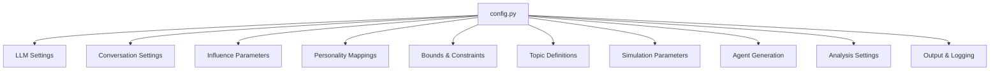
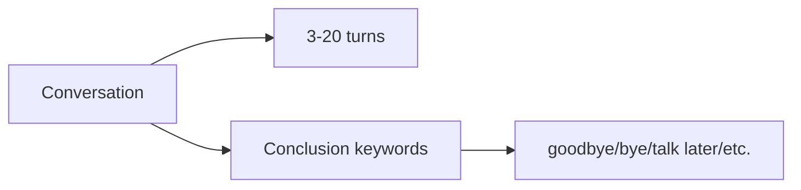
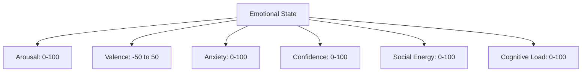
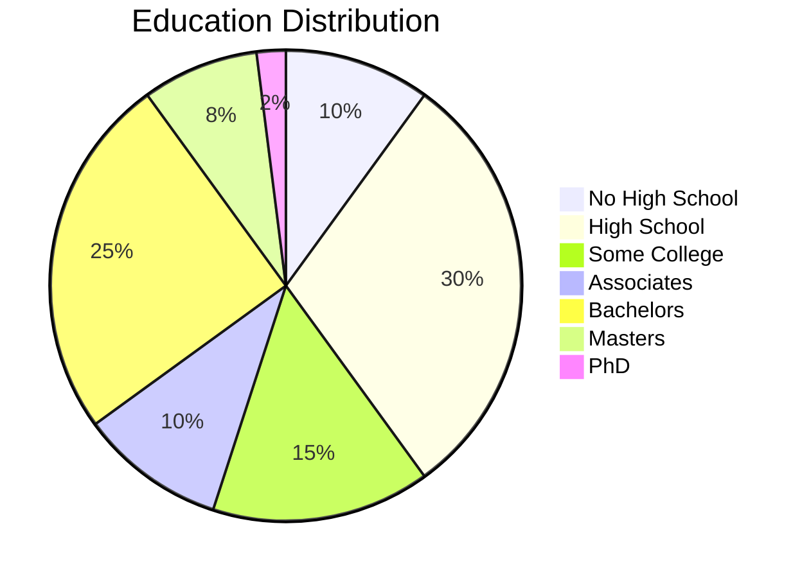
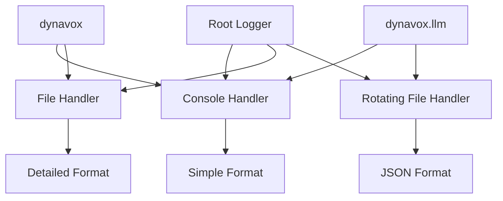

# Configuration Module Documentation

## Overview

The configuration module (`src/config.py`) serves as the central repository for all configurable parameters in the DynaVox framework. It defines constants, default values, and settings that control various aspects of the simulation, from LLM model selection to agent behavior parameters.

## Module Structure



## Configuration Categories

### LLM Settings

Defines available language models and their characteristics.

#### OpenAI Models
```python
OPENAI_MODELS = {
    "gpt-4o": "GPT-4o - Multimodal, fast, 83% cheaper than GPT-4 (128K context)",
    "gpt-4o-mini": "GPT-4o Mini - Most cost-efficient, $0.15/1M input (128K context)",
    "gpt-4-turbo": "GPT-4 Turbo - High capability, $10/1M input (128K context)",
    "gpt-3.5-turbo": "GPT-3.5 Turbo - Fast and cheap, $0.50/1M input"
}
```

#### Anthropic Models
```python
ANTHROPIC_MODELS = {
    "claude-opus-4": "Claude Opus 4 - Most powerful, $15/1M input (200K context)",
    "claude-3-5-sonnet": "Claude 3.5 Sonnet - Upgraded, same price as v3 (200K context)",
    "claude-3-5-haiku": "Claude 3.5 Haiku - Fast & cheap, $0.80/1M input (200K context)"
}
```

#### Model Defaults
- **DEFAULT_OPENAI_MODEL**: "gpt-4o"
- **DEFAULT_ANTHROPIC_MODEL**: "claude-3-5-sonnet"
- **LLM_TEMPERATURE**: 0.7 (creativity vs consistency balance)
- **LLM_MAX_TOKENS**: 1000 (response length limit)

### Conversation Settings

Controls conversation dynamics and flow.



- **MAX_CONVERSATION_TURNS**: 20
- **MIN_CONVERSATION_TURNS**: 3
- **CONCLUSION_KEYWORDS**: List of phrases that signal conversation end

### Influence Parameters

Governs how opinions change during interactions.

| Parameter | Value | Purpose |
|-----------|-------|---------|
| INFLUENCE_THRESHOLD | 0.1 | Minimum influence needed for change |
| MAX_POSITION_CHANGE | 20 | Maximum opinion shift per conversation |
| CERTAINTY_DECAY_RATE | 0.05 | Certainty reduction when challenged |

### Personality Behavior Mappings

Maps HEXACO trait values to behavioral categories.

```python
TRAIT_THRESHOLDS = {
    'very_low': 20,    # 0-20
    'low': 40,         # 21-40
    'medium': 60,      # 41-60
    'high': 80,        # 61-80
    'very_high': 100   # 81-100
}
```

### Bounds and Constraints

Defines valid ranges for various agent attributes.

#### Emotional State Bounds


#### Opinion Bounds
- **Position**: -100 to 100 (strong disagreement to strong agreement)
- **Certainty**: 0 to 100 (uncertain to absolutely certain)
- **Importance**: 0 to 100 (unimportant to critically important)
- **Knowledge**: 0 to 100 (ignorant to expert)
- **Emotional Charge**: 0 to 100 (neutral to highly emotional)

### Topic Definitions

Comprehensive topic configuration with background relevance mappings.

#### Topic Structure
```python
'climate_change': {
    'scale': (-100, 100),
    'labels': ('Climate skeptic', 'Climate activist'),
    'description': 'Views on climate change urgency and action'
}
```

#### Background Relevance
Maps professions and demographics to topic knowledge and biases:

```python
'climate_change': {
    'high_knowledge': ['environmental_scientist', 'policy_analyst', 'teacher'],
    'personal_impact': ['farmer', 'construction_worker', 'coastal_resident'],
    'skepticism_tendency': ['coal_miner', 'oil_worker', 'rural', 'conservative']
}
```

#### Available Topics (15+)
- Climate change
- Wealth inequality
- AI regulation
- Remote work
- Universal healthcare
- Social media regulation
- Immigration
- Nuclear energy
- Education reform
- Gun control
- Cryptocurrency
- Space exploration
- Genetic engineering
- Urban development
- Privacy vs security

### Simulation Parameters

Default settings for simulation execution.

```python
DEFAULT_SIMULATION_PARAMS = {
    'interaction_probability': 0.15,    # 15% chance of interaction
    'homophily_bias': 0.6,             # Preference for similar agents
    'max_interactions_per_agent': 2,    # Per round limit
    'rounds': 20                        # Total simulation rounds
}
```

### Agent Generation Parameters

Controls population diversity and demographics.

#### Age Distribution
- **Range**: 18-80 years
- **Distribution**: Natural demographic curve

#### Education Distribution


#### Occupation Categories
- **Unemployed**: Job seekers, between jobs
- **Service**: Retail, food service, cleaning
- **Manual Labor**: Construction, factory, warehouse
- **Clerical**: Administrative, data entry
- **Skilled Trades**: Electrician, plumber, chef
- **Education**: Teachers, counselors, librarians
- **Healthcare**: Nurses, technicians, therapists
- **Business**: Sales, managers, accountants
- **Professional**: Engineers, doctors, lawyers
- **Creative**: Artists, designers, writers
- **Public Service**: Police, firefighters, social workers

#### Socioeconomic Distribution
```python
'socioeconomic_distribution': {
    'poverty': 0.12,
    'working_poor': 0.18,
    'working_class': 0.30,
    'middle_class': 0.25,
    'upper_middle_class': 0.12,
    'wealthy': 0.03
}
```

### Interaction Planning Parameters

Controls conversation planning and topic selection.

```python
INTERACTION_PARAMS = {
    'max_topics_per_conversation': 3,
    'min_topic_score': 20,
    'disagreement_bonus': 1.2,      # Encourages diverse viewpoints
    'low_knowledge_penalty': 0.7    # Discourages uninformed debates
}
```

### State Update Parameters

Governs how agent states evolve.

```python
STATE_UPDATE_PARAMS = {
    'max_position_change_per_conversation': 0.15,  # 15% max change
    'certainty_increase_threshold': 0.7,           # Quality needed
    'emotional_reactivity_multiplier': 1.5,        # High emotionality
    'stress_tolerance_impact': 1.3                 # Low tolerance
}
```

### Analysis Parameters

Settings for post-simulation analysis.

```python
ANALYSIS_PARAMS = {
    'polarization_gap_threshold': 30,
    'echo_chamber_similarity_threshold': 0.7,
    'echo_chamber_min_interactions': 3,
    'influencer_top_n': 10
}
```

### Output Settings

File I/O and data persistence configuration.

```python
OUTPUT_SETTINGS = {
    'checkpoint_frequency': 5,      # Save every 5 rounds
    'checkpoint_dir': 'checkpoints',
    'results_dir': 'results',
    'log_conversations': True,
    'log_state_changes': True
}
```

### Visualization Settings

Parameters for generating plots and visualizations.

```python
VISUALIZATION_SETTINGS = {
    'figure_size': (12, 8),
    'color_scheme': 'viridis',
    'show_agent_names': True,
    'animation_interval': 500  # ms
}
```

### Logging Configuration

Comprehensive logging setup with multiple handlers and formatters.



#### Log Levels
- **DEBUG**: Detailed diagnostic information
- **INFO**: General informational messages
- **WARNING**: Potential issues
- **ERROR**: Error conditions
- **CRITICAL**: Severe failures

## Usage Examples

### Accessing Configuration Values
```python
from src.config import (
    DEFAULT_OPENAI_MODEL,
    MAX_CONVERSATION_TURNS,
    STANDARD_TOPICS
)

# Use in code
model = DEFAULT_OPENAI_MODEL
max_turns = MAX_CONVERSATION_TURNS
available_topics = list(STANDARD_TOPICS.keys())
```

### Overriding Defaults
```python
# Custom simulation parameters
custom_params = DEFAULT_SIMULATION_PARAMS.copy()
custom_params['interaction_probability'] = 0.25
custom_params['rounds'] = 30
```

### Topic Configuration
```python
# Get topic details
topic_info = STANDARD_TOPICS['climate_change']
scale = topic_info['scale']
labels = topic_info['labels']

# Check background relevance
relevance = TOPIC_BACKGROUND_RELEVANCE['climate_change']
experts = relevance['high_knowledge']
```

## Best Practices

1. **Immutability**: Treat all configuration values as read-only constants
2. **Validation**: Always validate against bounds defined in config
3. **Documentation**: Update config documentation when adding new parameters
4. **Backwards Compatibility**: Maintain old parameters when adding new ones
5. **Environment Variables**: Use for sensitive data (API keys) not in config

## Integration Points

The config module is imported and used by:
- **Agent Generator**: Uses personality biases, occupation categories
- **Conversation Planner**: Uses interaction parameters, topic definitions
- **State Updater**: Uses influence parameters, update constraints
- **Simulation Engine**: Uses default simulation parameters
- **Analysis Module**: Uses analysis thresholds and parameters
- **Visualization**: Uses plotting settings and color schemes

## Future Enhancements

Potential improvements:
- YAML/JSON configuration file support
- Environment-specific configurations
- Runtime configuration validation
- Configuration schema with type hints
- Dynamic configuration reloading
- Configuration presets for different scenarios