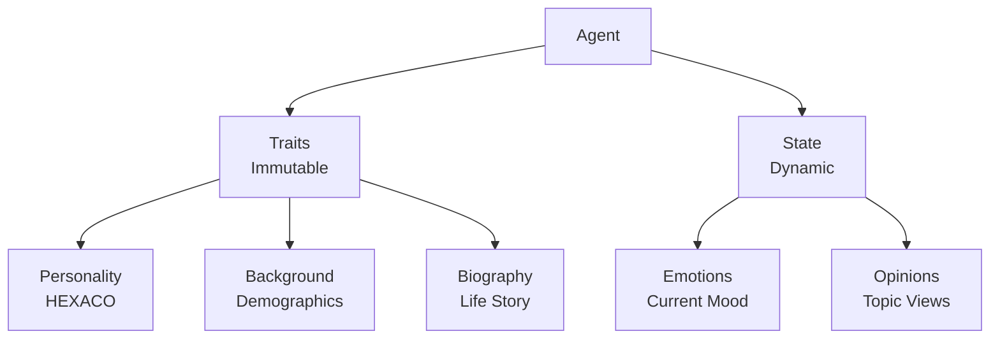
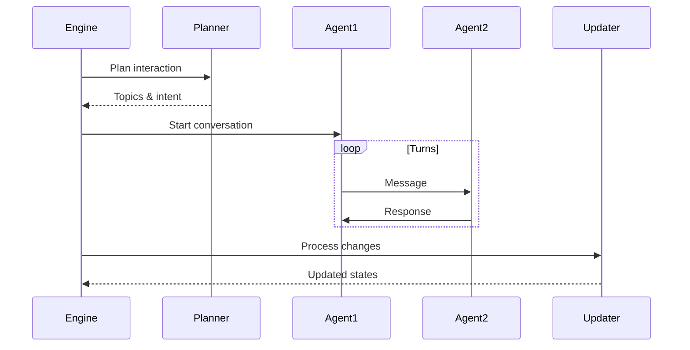
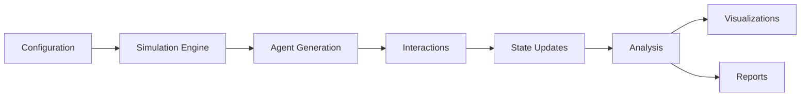
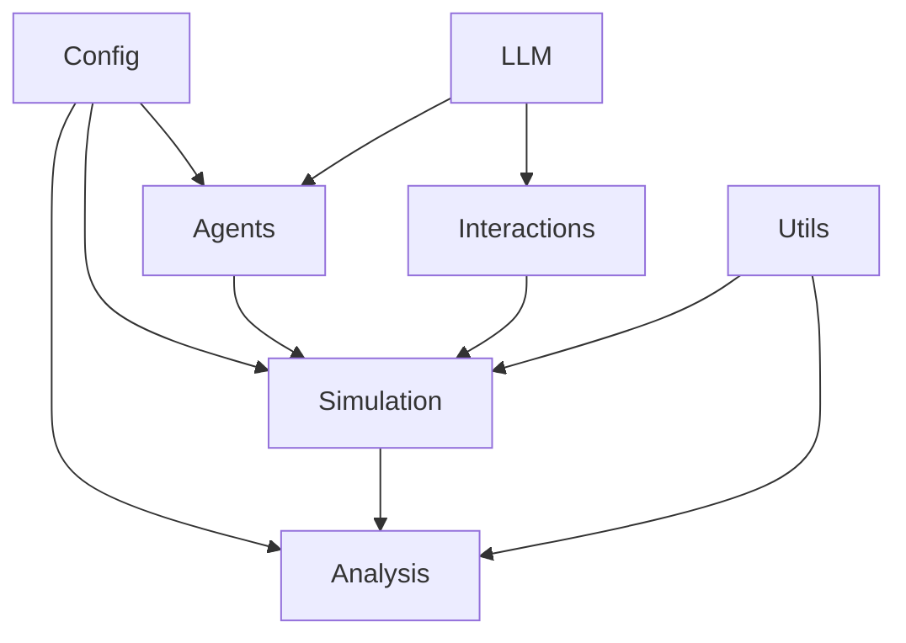

# DynaVox Documentation Index

Welcome to the comprehensive documentation for DynaVox, an agent-based social dynamics modeling framework powered by Large Language Models.

## Documentation Overview

This documentation is organized into the following sections:

### Core Modules

1. **[Agents Module](agents.md)**
   - Agent data structures and generation
   - HEXACO personality model implementation
   - Name generation and cultural diversity
   - Biography and conversation style creation

2. **[Interactions Module](interactions.md)**
   - Conversation orchestration (sync and async)
   - Pre-conversation planning
   - State updates and opinion evolution
   - Enhanced opinion dynamics

3. **[LLM Module](llm.md)**
   - Language model client interface
   - OpenAI and Anthropic provider implementations
   - Model selection and cost estimation
   - Prompt templates and management

4. **[Simulation Module](simulation.md)**
   - Core simulation engine
   - Population initialization
   - Round execution logic
   - Metrics calculation and analysis

5. **[Analysis Module](analysis.md)**
   - Simulation reporting and insights
   - Visualization generation
   - Influence analysis
   - Echo chamber detection

6. **[Utils Module](utils.md)**
   - Enhanced logging with unicode indicators
   - Real-time data persistence
   - Directory structure management

7. **[Configuration Module](config.md)**
   - All configurable parameters
   - Model definitions and costs
   - Topic definitions
   - Default settings

### Design Documents

- **[Design Specification](design-spec.md)** - Original design concept and goals
- **[Implementation Specification](implementation-spec.md)** - Technical implementation details

## Quick Navigation

### For Users

If you want to:
- **Run a simulation**: Start with the main [README](../README.md) and [Configuration](config.md)
- **Understand agents**: Read [Agents Module](agents.md)
- **Analyze results**: Check [Analysis Module](analysis.md)
- **Configure parameters**: See [Configuration Module](config.md)

### For Developers

If you want to:
- **Add new LLM providers**: See [LLM Module](llm.md)
- **Modify conversation dynamics**: Read [Interactions Module](interactions.md)
- **Enhance analysis**: Check [Analysis Module](analysis.md)
- **Understand architecture**: Review [Design Spec](design-spec.md) and [Implementation Spec](implementation-spec.md)

## Key Concepts

### Agent Architecture

### Conversation Flow

### Data Flow

## Module Dependencies

## Getting Started

1. **Installation**: Follow the [README](../README.md#installation)
2. **Configuration**: Review [config.md](config.md) for available options
3. **First Simulation**: Use the quick start examples
4. **Understanding Results**: Read [analysis.md](analysis.md)

## Advanced Usage

For advanced usage scenarios:
- **Custom populations**: See [agents.md](agents.md#agent-generation-flow)
- **Parallel execution**: Check [interactions.md](interactions.md#asyncconversationorchestrator)
- **Custom analysis**: Review [analysis.md](analysis.md#custom-analysis)
- **Enhanced logging**: Read [utils.md](utils.md#enhanced-logging)

## Contributing

When contributing to DynaVox:
1. Review the relevant module documentation
2. Follow the existing patterns and conventions
3. Update documentation when adding features
4. Add tests for new functionality

## Support

For questions or issues:
- Check the relevant module documentation first
- Review the [troubleshooting section](../README.md#troubleshooting)
- Open an issue on GitHub with details