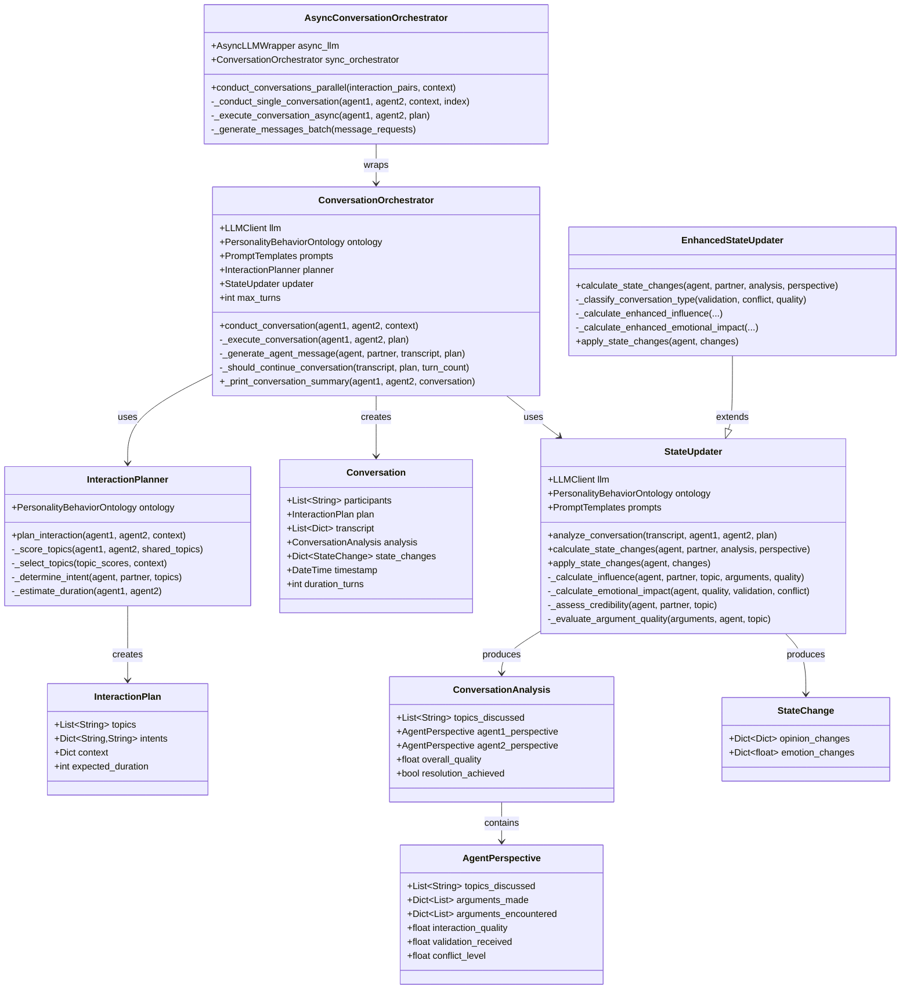
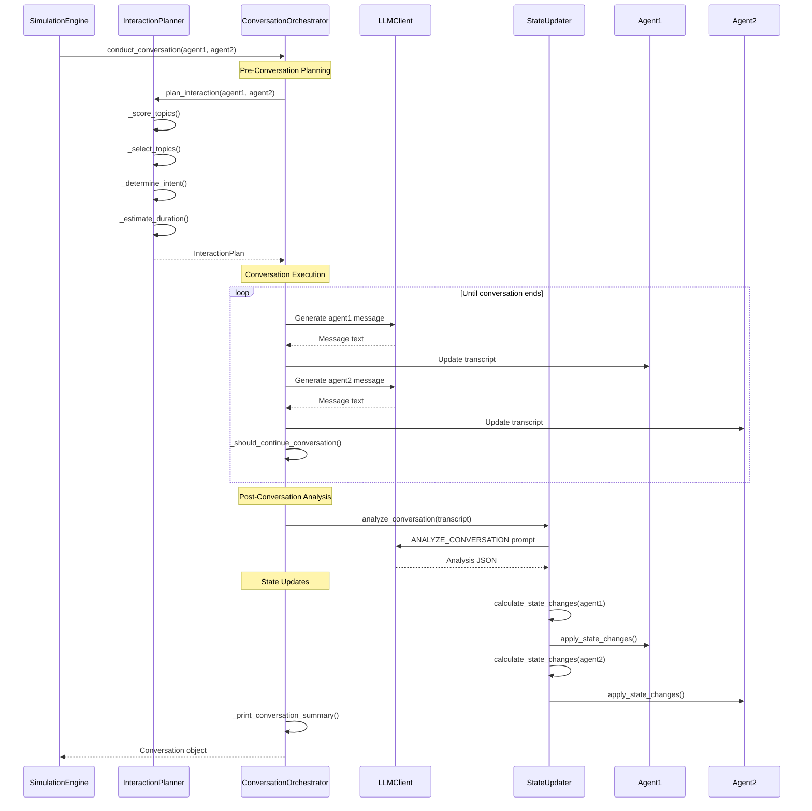
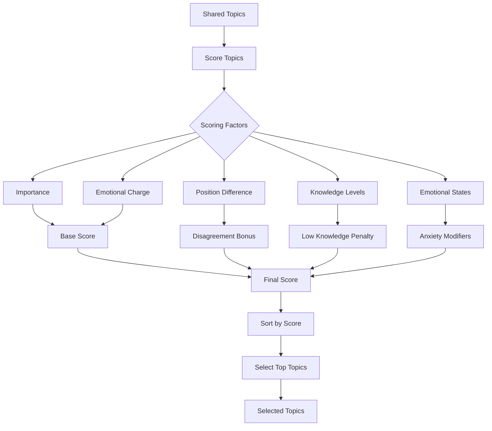
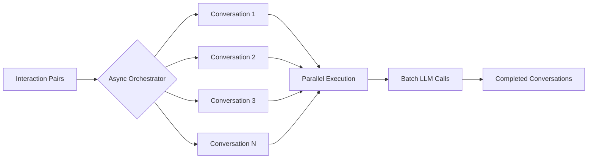
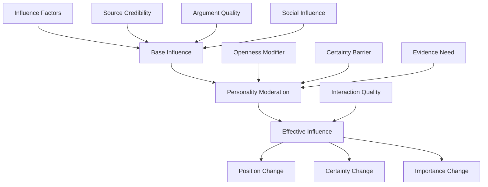
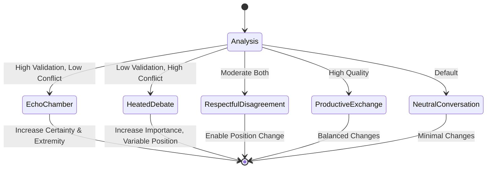
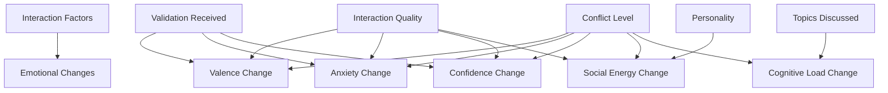

# Interactions Module Documentation

## Overview

The interactions module manages all aspects of agent conversations in DynaVox, from pre-conversation planning through execution to post-conversation state updates. It implements a sophisticated system that considers personality traits, emotional states, and conversation dynamics to create realistic social interactions.

## Module Structure



## Conversation Flow

The complete conversation process follows this sequence:



## Core Components

### 1. Interaction Planning (`planner.py`)

The `InteractionPlanner` determines what agents will discuss and why:

#### Topic Selection Process



#### Intent Determination

Conversation intents are personality-driven:
- **Learn**: High openness, low emotionality
- **Persuade**: High extraversion, low agreeableness
- **Validate**: High emotionality, low openness
- **Bond**: High agreeableness, high extraversion
- **Debate**: High openness, low agreeableness
- **Explore**: High openness, high conscientiousness

### 2. Conversation Orchestration (`orchestrator.py`)

The `ConversationOrchestrator` manages the conversation execution:

#### Message Generation
Each message is generated considering:
- Agent's full profile and current state
- Conversation history
- Assigned intent
- Personality-based behavior patterns
- Current emotional state

#### Conversation Termination
Conversations end when:
- Maximum turns reached
- Natural conclusion keywords detected
- Social energy depleted
- High cognitive load for both agents

#### Summary Generation
After each conversation:
- Brief 50-word summary generated
- Opinion changes displayed with directional indicators
- Emotional changes shown with appropriate emojis
- Interaction quality assessed

### 3. Asynchronous Orchestration (`async_orchestrator.py`)

Enables parallel conversation execution:



#### Parallel Processing
- Uses `AsyncLLMWrapper` with ThreadPoolExecutor
- Batches multiple conversations for efficiency
- Shows real-time status updates
- Falls back to sequential execution on failure

### 4. State Updates (`updater.py`)

The `StateUpdater` analyzes conversations and calculates state changes:

#### Influence Calculation



#### Key Influence Factors:

1. **Source Credibility** (0.0-1.0):
   - Education level comparison
   - Knowledge differential
   - Personality-based trust
   - Professional relevance

2. **Argument Quality** (0.0-1.0):
   - LLM evaluation of arguments
   - Agent's conscientiousness affects requirements
   - Openness affects receptivity

3. **Social Influence** (0.0-1.0):
   - High agreeableness + good interaction → influence
   - Empathy-driven opinion change
   - Conflict avoidance motivations

### 5. Enhanced State Updates (`updater_enhanced.py`)

The `EnhancedStateUpdater` adds sophisticated conversation dynamics:

#### Conversation Type Classification



#### Enhanced Dynamics by Type:

1. **Echo Chamber**:
   - Same-side validation → increased extremity
   - Certainty increases significantly
   - Importance increases moderately
   - Opposite-side validation → cognitive dissonance

2. **Heated Debate**:
   - Disagreeable personalities → entrenchment
   - Agreeable personalities → larger shifts
   - Importance increases dramatically
   - High emotional charge

3. **Respectful Disagreement**:
   - Most conducive to genuine change
   - Moderate certainty reduction
   - Increased importance through engagement

4. **Productive Exchange**:
   - Quality arguments increase certainty
   - Balanced position changes
   - Knowledge increases

## Opinion Evolution Mechanics

### Position Changes

```python
# Base calculation
position_diff = partner.position - agent.position
position_delta = position_diff * effective_influence * 0.15

# Enhanced modifiers
if conversation_type == "echo_chamber" and same_side:
    position_delta = sign(current_position) * 5 * validation_level
elif conversation_type == "heated_debate":
    if agent.agreeableness < 40:  # Backlash effect
        position_delta = -position_delta * 0.5
    else:
        position_delta *= 2.0
```

### Certainty Evolution

- Increases with: validation, good arguments, echo chambers
- Decreases with: strong counter-arguments, cognitive dissonance
- Personality moderation via conscientiousness

### Importance Changes

- Conflict always increases importance
- Emotional engagement increases importance
- Validation in echo chambers increases importance
- High arousal states amplify importance changes

## Emotional Impact

### Base Emotional Changes



### Enhanced Emotional Dynamics

By conversation type:
- **Echo Chamber**: +8 valence, +10 confidence, +5 social energy
- **Heated Debate**: -5 valence, +10 anxiety, +15 cognitive load
- **Respectful Disagreement**: +3 valence (if open), +10 cognitive load
- **Productive Exchange**: +5 valence, +5 confidence, +5 cognitive load

## Professional Topic Relevance

The system maintains detailed mappings of which professions have expertise in which topics:

- **Climate Change**: Environmental scientists, farmers, engineers, educators
- **Healthcare**: Medical professionals, insurance workers, administrators
- **Remote Work**: Tech workers, creatives, consultants, educators
- **AI Regulation**: Tech professionals, lawyers, ethicists, affected workers
- **Wealth Inequality**: Economists, social workers, service industry, academics

Professional relevance increases source credibility by 15%.

## Usage Patterns

### Single Conversation
```python
orchestrator = ConversationOrchestrator(llm_client)
conversation = orchestrator.conduct_conversation(agent1, agent2, context)
```

### Parallel Conversations
```python
async_orchestrator = AsyncConversationOrchestrator(llm_client)
conversations = await async_orchestrator.conduct_conversations_parallel(
    interaction_pairs, context
)
```

### Custom State Updates
```python
updater = EnhancedStateUpdater(llm_client)
state_changes = updater.calculate_state_changes(
    agent, partner, analysis, perspective
)
updater.apply_state_changes(agent, state_changes)
```

## Key Design Principles

1. **Personality-Driven**: All aspects of conversation flow from HEXACO traits
2. **Multi-Factor Influence**: Opinion changes consider many realistic factors
3. **Emotional Realism**: Emotional states affect and are affected by conversations
4. **Conversation Dynamics**: Different conversation types produce different outcomes
5. **Professional Expertise**: Domain knowledge affects credibility
6. **Graceful Degradation**: Fallback mechanisms for LLM failures