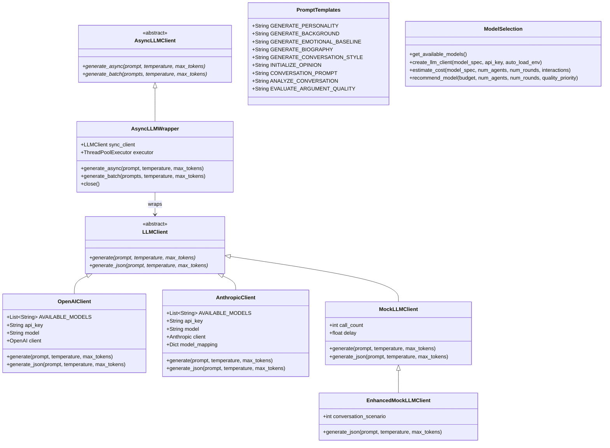
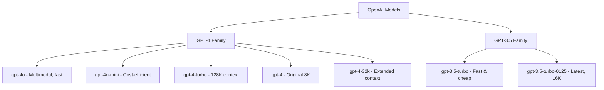
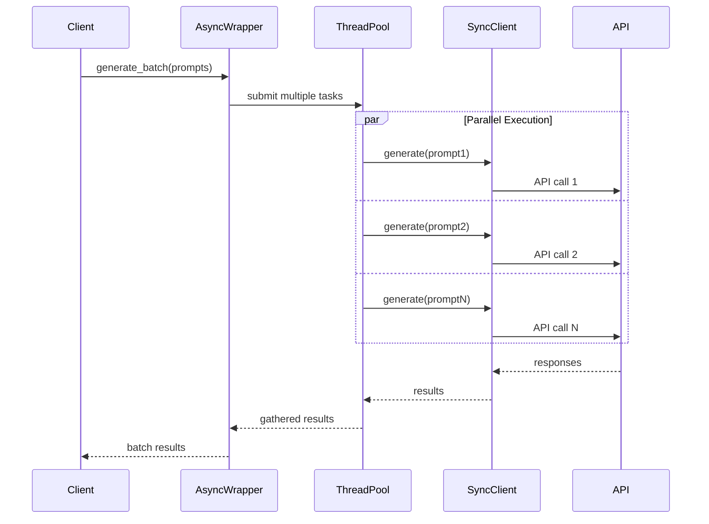
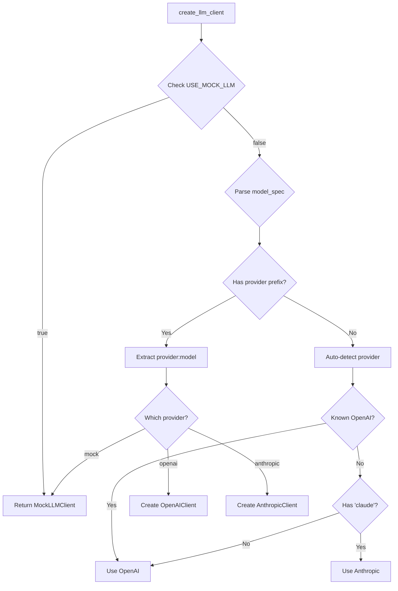

# LLM Module Documentation

## Overview

The LLM (Large Language Model) module provides a unified interface for interacting with different language model providers (OpenAI, Anthropic) and includes sophisticated prompt engineering, model selection utilities, and cost estimation features. It abstracts away provider-specific implementations while maintaining flexibility for different use cases.

## Module Structure



## Core Components

### 1. LLM Client Interface (`client.py`)

The abstract `LLMClient` class defines the interface all implementations must follow:

```python
class LLMClient(ABC):
    @abstractmethod
    def generate(self, prompt: str, temperature: float = 0.7, 
                max_tokens: int = 1000) -> str:
        """Generate text from a prompt."""
        pass
    
    @abstractmethod
    def generate_json(self, prompt: str, temperature: float = 0.7, 
                     max_tokens: int = 1000) -> Dict[str, Any]:
        """Generate and parse JSON response."""
        pass
```

### 2. Provider Implementations

#### OpenAI Client

Supports all current OpenAI models:



Features:
- Automatic model validation with warnings
- Proper error handling for API failures
- JSON extraction from responses
- Debug logging of prompts and responses

#### Anthropic Client

Supports Claude models with automatic name mapping:

```python
model_mapping = {
    "claude-3-5-haiku": "claude-3-haiku-20240307",
    "claude-3-5-sonnet": "claude-3-5-sonnet-20241022",
    # ... other mappings
}
```

Features:
- Model name normalization
- Enhanced authentication error messages
- Compatible API interface with OpenAI

### 3. Mock Clients

#### Basic MockLLMClient

For testing without API calls:
- Minimal delay (0.01s) for fast testing
- Generates contextual responses based on prompt content
- Provides varied mock data to avoid singular matrices

#### EnhancedMockLLMClient

Cycles through realistic conversation scenarios:
1. **Echo Chamber**: High validation, low conflict
2. **Heated Debate**: Low validation, high conflict
3. **Respectful Disagreement**: Balanced dynamics
4. **Productive Exchange**: High quality discussion
5. **Neutral Conversation**: Standard interaction

### 4. Async Support (`async_client.py`)



Features:
- Wraps synchronous clients for async operations
- Thread pool for parallel API calls
- Batch processing for efficiency
- Proper resource cleanup

### 5. Prompt Templates (`prompts.py`)

The `PromptTemplates` class contains carefully crafted prompts for each generation task:

#### Key Prompts

1. **GENERATE_PERSONALITY**
   - Uses HEXACO model with 0-100 scales
   - Includes trait definitions and level descriptions
   - Ensures psychological consistency

2. **GENERATE_BACKGROUND**
   - Creates demographics aligned with personality
   - Includes diverse life paths
   - Uses realistic name generation

3. **GENERATE_BIOGRAPHY**
   - 800-1200 word life story
   - Weaves all traits coherently
   - Multiple narrative techniques

4. **CONVERSATION_PROMPT**
   - Embodies full agent profile
   - Personality-specific behaviors
   - Natural speech patterns

5. **ANALYZE_CONVERSATION**
   - Evaluates interaction quality
   - Measures validation and conflict
   - Identifies influence factors

### 6. Model Selection (`model_selection.py`)

Provides intelligent model selection and cost management:

#### Model Discovery

```python
models = get_available_models()
# Returns dict of all models with descriptions:
# "openai:gpt-4o": "GPT-4o - Multimodal, fast, cost-effective (128K context)"
```

#### Smart Client Creation



#### Cost Estimation

```python
# Token usage estimates
TOKENS_PER_AGENT_GEN = 3000      # Full agent generation
TOKENS_PER_CONVERSATION = 2000   # Typical conversation
TOKENS_PER_ANALYSIS = 500        # Post-conversation analysis

# Example cost calculation
cost = estimate_cost(
    model_spec="openai:gpt-4o",
    num_agents=20,
    num_rounds=10,
    interactions_per_round=10
)
# Returns detailed breakdown with total cost
```

#### Model Pricing (December 2024)

| Model | Input (per 1M tokens) | Output (per 1M tokens) |
|-------|----------------------|------------------------|
| **OpenAI** | | |
| gpt-4o | $3.00 | $10.00 |
| gpt-4o-mini | $0.15 | $0.60 |
| gpt-4-turbo | $10.00 | $30.00 |
| gpt-4 | $30.00 | $60.00 |
| gpt-3.5-turbo | $0.50 | $1.50 |
| **Anthropic** | | |
| claude-opus-4 | $15.00 | $75.00 |
| claude-sonnet-4 | $3.00 | $15.00 |
| claude-3-5-haiku | $0.80 | $4.00 |

#### Model Recommendation

```python
# Recommends best model for budget and requirements
model = recommend_model(
    budget=50.0,           # USD
    num_agents=100,        
    num_rounds=20,
    quality_priority=0.7   # 0=cost, 1=quality
)
# Considers both quality scores and cost constraints
```

## Prompt Engineering Best Practices

### 1. Structured Output

All generation prompts end with explicit JSON format requirements:
```
Respond with ONLY a JSON object in this exact format:
{
  "field1": <type>,
  "field2": <type>
}
```

### 2. Contextual Grounding

Prompts include relevant context:
- Personality traits when generating background
- Background when generating biography
- Full profile when generating conversations

### 3. Constraint Specification

Clear boundaries and validation rules:
- Value ranges (e.g., 0-100, -50 to +50)
- Valid options (e.g., education levels)
- Psychological consistency requirements

### 4. Behavioral Guidance

Detailed instructions for natural behavior:
- Speech pattern variations by personality
- Emotional expression guidelines
- Conversation dynamics

## Usage Examples

### Basic Generation
```python
from src.llm import create_llm_client

# Auto-detect model type
client = create_llm_client("gpt-4o-mini")

# Generate text
response = client.generate("Describe a sunset", temperature=0.8)

# Generate structured data
data = client.generate_json(
    "Generate a person's age and occupation as JSON",
    temperature=0.5
)
```

### Cost-Aware Usage
```python
# Estimate costs before running
cost = estimate_cost("openai:gpt-4o", 
                    num_agents=50, 
                    num_rounds=10,
                    interactions_per_round=25)
print(f"Estimated cost: ${cost['estimated_cost_usd']}")

# Get recommendation within budget
model = recommend_model(budget=20.0, 
                       num_agents=50,
                       num_rounds=10,
                       quality_priority=0.6)
```

### Async Batch Processing
```python
async def process_batch():
    wrapper = AsyncLLMWrapper(client)
    prompts = [f"Describe emotion {i}" for i in range(10)]
    results = await wrapper.generate_batch(prompts)
    wrapper.close()
    return results
```

## Environment Configuration

Required environment variables:
```bash
# .env file
OPENAI_API_KEY=sk-...
ANTHROPIC_API_KEY=sk-ant-...
DEFAULT_MODEL=openai:gpt-4o-mini
USE_MOCK_LLM=false  # Set to true for testing
```

## Error Handling

The module implements comprehensive error handling:

1. **API Key Validation**: Clear messages for missing/invalid keys
2. **Model Validation**: Warnings for unknown models
3. **JSON Parsing**: Fallbacks for malformed responses
4. **Network Errors**: Appropriate error propagation
5. **Rate Limiting**: Handled by underlying client libraries

## Performance Considerations

1. **Caching**: No built-in caching (stateless design)
2. **Batching**: Use AsyncLLMWrapper for parallel calls
3. **Token Limits**: Prompts designed to fit within limits
4. **Temperature**: Lower for structured data, higher for creative text
5. **Mock Testing**: Use MockLLMClient for development

## Key Design Principles

1. **Provider Agnostic**: Unified interface across providers
2. **Cost Awareness**: Built-in cost estimation and optimization
3. **Type Safety**: Structured JSON generation with validation
4. **Testability**: Comprehensive mock implementations
5. **Extensibility**: Easy to add new providers or models