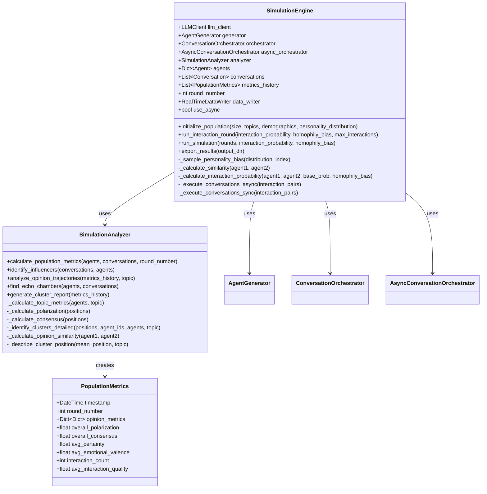
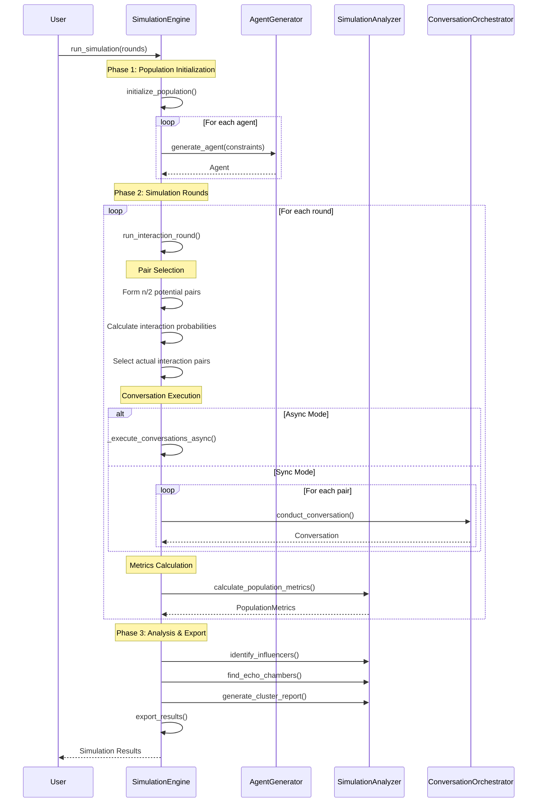
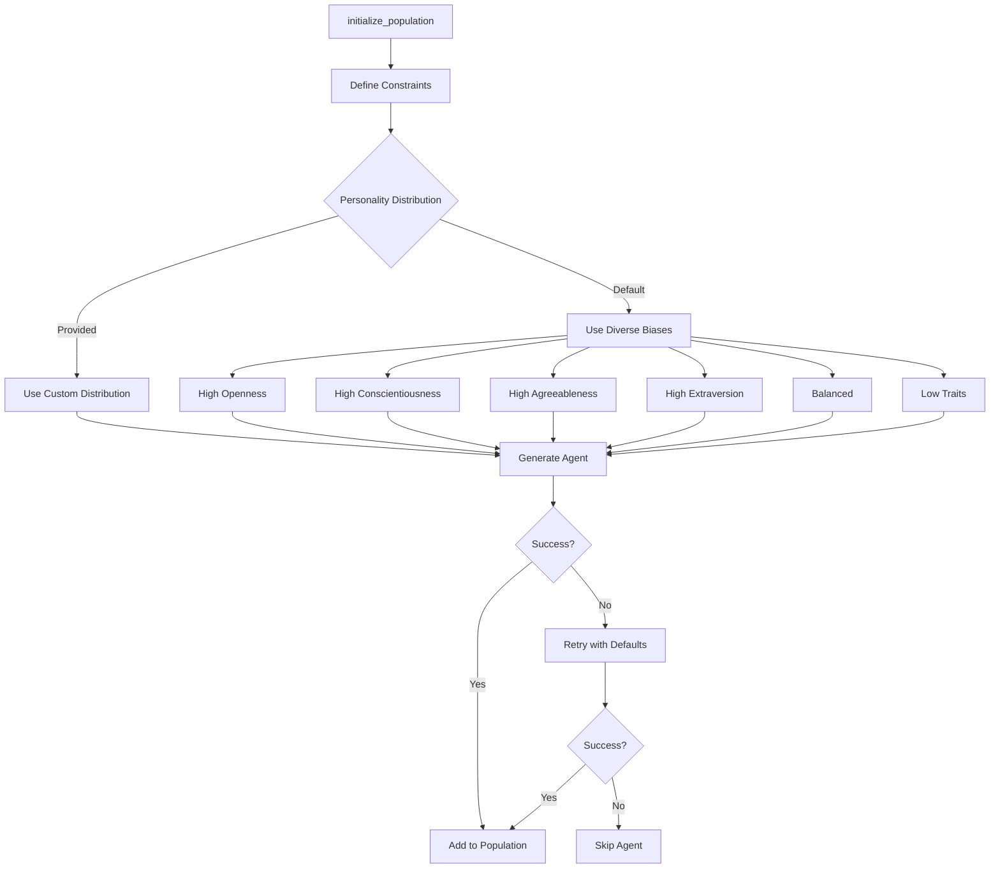
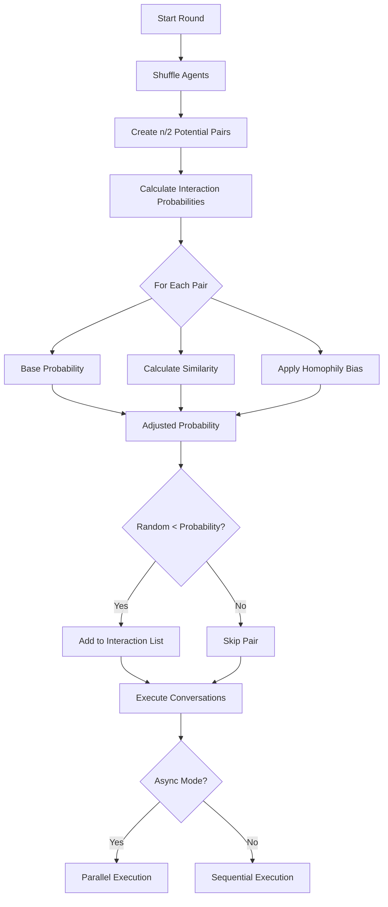
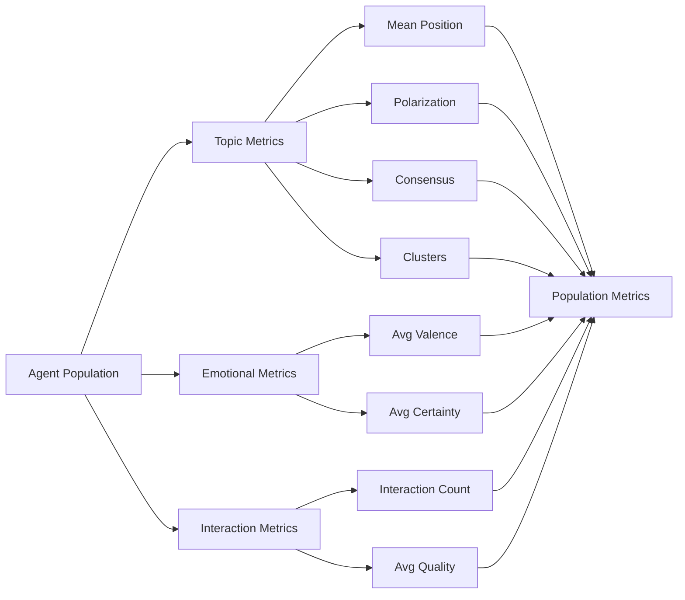
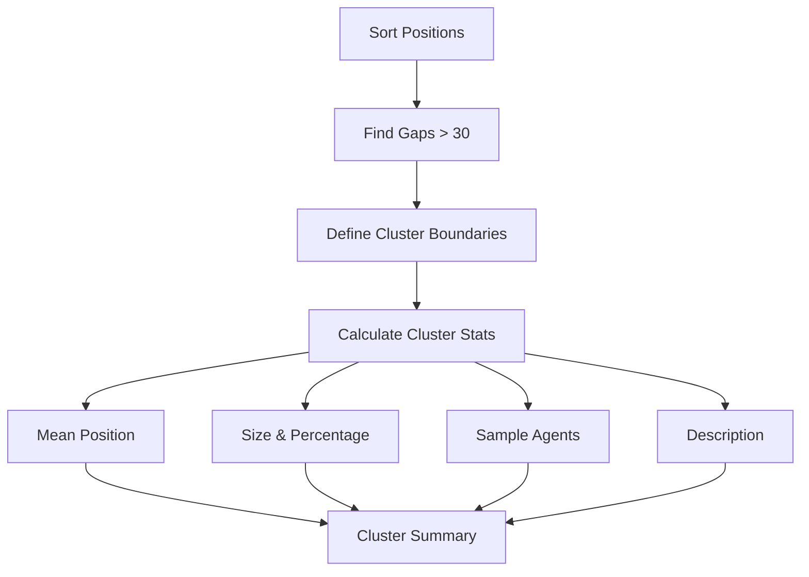

# Simulation Module Documentation

## Overview

The simulation module is the core engine of DynaVox, orchestrating the entire agent-based social dynamics simulation. It manages agent population creation, interaction rounds, conversation scheduling, metrics calculation, and result analysis. The module supports both synchronous and asynchronous execution modes for scalability.

## Module Structure



## Simulation Flow

The complete simulation process follows this sequence:



## Core Components

### 1. Simulation Engine (`engine.py`)

The main coordinator for the entire simulation:

#### Population Initialization



Default personality biases for diversity:
- High openness
- High conscientiousness
- High agreeableness
- High extraversion
- Balanced
- Low agreeableness
- High emotionality
- Low openness
- Low conscientiousness
- Low extraversion
- Various professional biases (analytical, creative, practical)

#### Interaction Round Mechanics

Each round follows a sophisticated pairing and selection process:



##### Similarity Calculation

Agents' similarity is calculated across multiple dimensions:

```python
similarity = weighted_average([
    personality_similarity * 0.3,
    opinion_similarity * 0.4,
    background_similarity * 0.2,
    emotional_similarity * 0.1
])
```

##### Homophily-Adjusted Probability

```python
# High homophily (>0.5): Similar agents more likely to interact
if homophily_bias > 0.5:
    adjusted_prob = base_prob * (0.5 + similarity * homophily_strength)
# Low homophily (<0.5): Different agents more likely to interact  
else:
    adjusted_prob = base_prob * (0.5 + (1 - similarity) * homophily_strength)
```

#### Conversation Execution Modes

##### Synchronous Mode
- Conversations execute one at a time
- Simpler debugging and monitoring
- Suitable for smaller populations

##### Asynchronous Mode
- All conversations in a round execute in parallel
- Uses ThreadPoolExecutor for concurrent LLM calls
- Visual status indicators during execution
- Significantly faster for large populations

### 2. Simulation Analyzer (`analyzer.py`)

Provides comprehensive analysis of simulation dynamics:

#### Population Metrics Calculation



#### Opinion Clustering Algorithm

The analyzer identifies opinion clusters using a gap-based approach:



Cluster descriptions are generated based on mean position:
- `> 50`: "strongly support"
- `20 to 50`: "moderately support"
- `-20 to 20`: "are neutral about"
- `-50 to -20`: "moderately oppose"
- `< -50`: "strongly oppose"

#### Polarization Measurement

Polarization is calculated as the bimodality of opinion distribution:

```python
# Find histogram peaks
peaks = find_local_maxima(opinion_histogram)

if len(peaks) >= 2:
    # Distance between two highest peaks
    distance = abs(peak1_pos - peak2_pos) / 200
    
    # Balance of peak heights
    height_ratio = min(peak1_height, peak2_height) / max(peak1_height, peak2_height)
    
    # Polarization combines distance and balance
    polarization = distance * height_ratio
```

#### Influencer Identification

Agents are ranked by total opinion change they cause in others:

```python
for conversation in conversations:
    for agent_id, changes in conversation.state_changes.items():
        partner_id = get_conversation_partner(agent_id)
        influence_scores[partner_id] += sum_absolute_opinion_changes(changes)
```

#### Echo Chamber Detection

Identifies groups that:
1. Interact frequently (≥3 times)
2. Have high opinion similarity (>0.7)
3. Form clusters of ≥3 agents

### 3. Real-Time Data Export

The engine supports real-time data writing for monitoring:

```python
if self.data_writer:
    # After agent creation
    self.data_writer.update_agent(agent)
    
    # After conversation
    self.data_writer.add_conversation(conversation)
    
    # After metrics calculation
    self.data_writer.add_metrics(metrics)
```

## Configuration Options

### Population Parameters
- `size`: Number of agents (typical: 10-200)
- `topics`: List of opinion topics
- `demographics`: Constraints on age, occupation, etc.
- `personality_distribution`: Custom trait distributions

### Interaction Parameters
- `interaction_probability`: Base chance of interaction (0.0-1.0)
- `homophily_bias`: Preference for similar agents (0.0-1.0)
  - 0.0: Strong preference for different agents
  - 0.5: No preference (random)
  - 1.0: Strong preference for similar agents
- `max_interactions_per_agent`: Limit per round

### Execution Parameters
- `rounds`: Number of simulation rounds
- `use_async`: Enable parallel conversation execution
- `seed`: Random seed for reproducibility

## Output Structure

```
output_dir/
├── data/
│   ├── agents.json          # Final agent states
│   ├── conversations.json   # All conversations
│   └── metrics_history.json # Metrics by round
├── visualizations/
│   ├── opinion_evolution_*.png
│   ├── polarization_*.png
│   └── interaction_network.png
├── reports/
│   ├── simulation_report.txt
│   ├── cluster_analysis.json
│   └── influencer_report.csv
├── checkpoints/
│   └── round_*.json
└── analysis.json           # Key findings
```

## Key Algorithms

### 1. Pairing Algorithm (n/2 pairs)

```python
def create_potential_pairs(agents):
    shuffled = random.shuffle(agents)
    pairs = []
    
    # Create n/2 pairs from shuffled list
    for i in range(0, len(shuffled)-1, 2):
        pairs.append((shuffled[i], shuffled[i+1]))
    
    # Fill remaining with random pairs if needed
    while len(pairs) < target_pairs:
        pair = random.sample(unused_agents, 2)
        pairs.append(pair)
    
    return pairs
```

### 2. Similarity Calculation

```python
def calculate_similarity(agent1, agent2):
    # Personality similarity (HEXACO traits)
    personality_sim = 1 - euclidean_distance(
        agent1.personality, agent2.personality
    ) / max_distance
    
    # Opinion similarity
    shared_topics = set(agent1.opinions) & set(agent2.opinions)
    opinion_distances = [
        abs(agent1.opinions[t].position - agent2.opinions[t].position) / 200
        for t in shared_topics
    ]
    opinion_sim = 1 - mean(opinion_distances)
    
    # Background similarity
    background_sim = calculate_tag_overlap(
        agent1.background, agent2.background
    )
    
    # Emotional state similarity
    emotional_sim = 1 - abs(
        agent1.emotional_state.valence - agent2.emotional_state.valence
    ) / 100
    
    # Weighted combination
    return (personality_sim * 0.3 + opinion_sim * 0.4 + 
            background_sim * 0.2 + emotional_sim * 0.1)
```

## Usage Example

```python
from src.simulation import SimulationEngine
from src.llm import create_llm_client

# Initialize
llm_client = create_llm_client("gpt-4o-mini")
engine = SimulationEngine(llm_client, seed=42, use_async=True)

# Create population
engine.initialize_population(
    size=50,
    topics=['climate_change', 'ai_regulation', 'wealth_inequality'],
    demographics={'age_range': [25, 65]}
)

# Run simulation
engine.run_simulation(
    rounds=10,
    interaction_probability=0.2,
    homophily_bias=0.6
)

# Export results
engine.export_results("output/my_simulation")

# Access analysis
print(f"Final polarization: {engine.metrics_history[-1].overall_polarization}")
influencers = engine.analyzer.identify_influencers(
    engine.conversations, engine.agents
)
```

## Performance Considerations

1. **Async Mode**: Use for populations > 20 agents
2. **Batch Size**: Async mode processes all round conversations in parallel
3. **Memory**: ~10MB per 100 agents with full history
4. **LLM Costs**: See [LLM module](llm.md) for cost estimation
5. **Checkpointing**: Automatic every 5 rounds for recovery

## Key Design Principles

1. **Modularity**: Clear separation between generation, interaction, and analysis
2. **Scalability**: Async support for large populations
3. **Reproducibility**: Seed support for deterministic simulations
4. **Observability**: Real-time data export and comprehensive metrics
5. **Flexibility**: Configurable parameters for different research questions