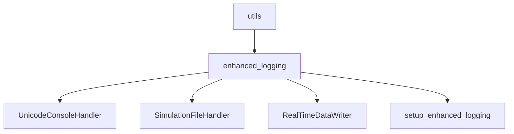
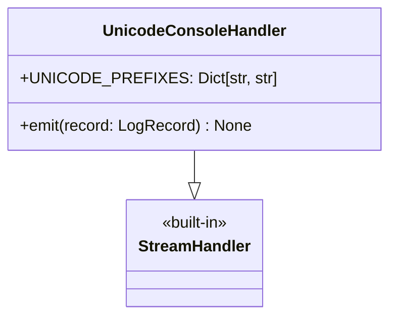
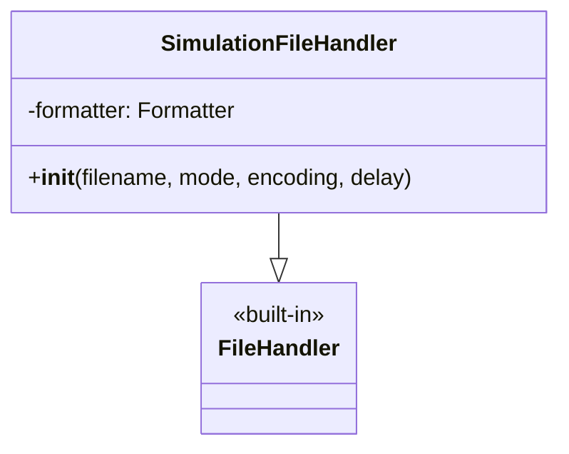
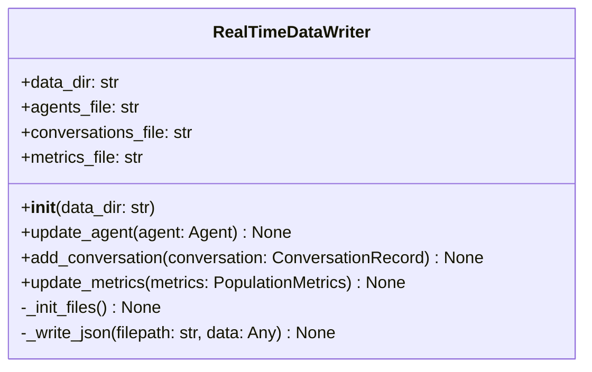
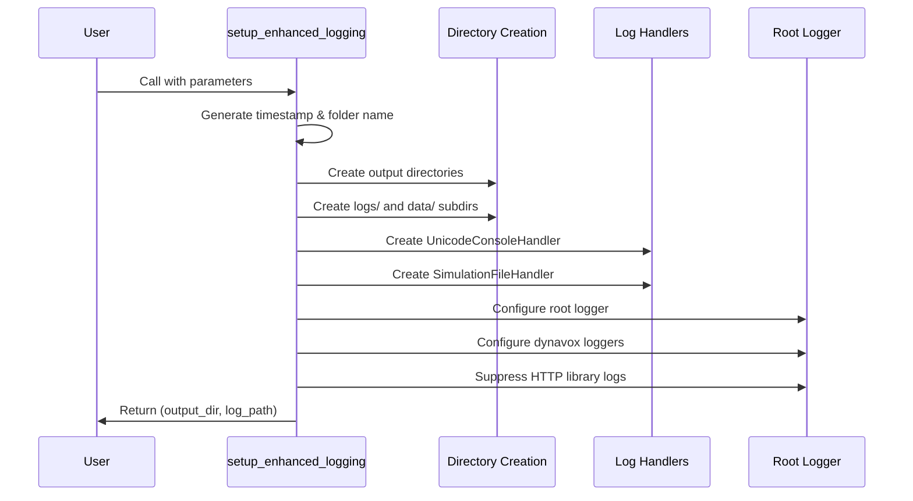

# Utils Module Documentation

## Overview

The utils module provides utility functions and classes that support the DynaVox simulation framework. Currently, it includes the enhanced logging system that provides unicode-enriched console output, structured file logging, and real-time data persistence.

## Module Structure



## Components

### UnicodeConsoleHandler

A custom logging handler that enriches console output with unicode indicators for better readability.



#### Unicode Prefix Mapping

| Message Type | Unicode | Purpose |
|-------------|---------|---------|
| DEBUG | 🐛 | Debug information |
| INFO | ℹ️ | General information |
| WARNING | ⚠️ | Warning messages |
| ERROR | ❌ | Error messages |
| CRITICAL | 🔥 | Critical errors |
| AGENT_CREATE | 👤 | Agent creation |
| CONVERSATION | 💬 | Conversation events |
| OPINION_CHANGE | 🔄 | Opinion updates |
| EMOTION_CHANGE | 😊 | Emotional changes |
| ANALYSIS | 📊 | Analysis results |
| SAVE | 💾 | Data saving |
| COMPLETE | ✅ | Task completion |
| START | 🚀 | Process start |
| ROUND | 🔁 | Round markers |
| THINK | 🤔 | Agent thinking |
| INTERACT | 🤝 | Interactions |
| PARALLEL | ⚡ | Parallel execution |
| CONFIG | ⚙️ | Configuration |

### SimulationFileHandler

Enhanced file handler that captures comprehensive simulation logs with detailed formatting.



Features:
- UTF-8 encoding by default
- Detailed timestamp formatting
- Structured log format with logger names
- Captures all log levels for complete audit trail

### RealTimeDataWriter

Manages real-time persistence of simulation data to JSON files, enabling monitoring of ongoing simulations.



#### Real-time Data Files

1. **agents_realtime.json**: Current state of all agents
   ```json
   {
     "agent_001": {
       "id": "agent_001",
       "name": "Maria Santos",
       "age": 34,
       "occupation": "Teacher",
       "personality": {...},
       "opinions": {...},
       "emotional_state": {...},
       "last_updated": "2024-01-27T10:30:00"
     }
   }
   ```

2. **conversations_realtime.json**: All conversations as they occur
   ```json
   [
     {
       "id": 0,
       "participants": ["agent_001", "agent_002"],
       "timestamp": "2024-01-27T10:15:00",
       "duration_turns": 8,
       "topics": ["healthcare"],
       "summary": "Discussed healthcare costs...",
       "state_changes": {...}
     }
   ]
   ```

3. **metrics_history_realtime.json**: Population metrics per round
   ```json
   [
     {
       "round": 1,
       "timestamp": "2024-01-27T10:20:00",
       "overall_polarization": 0.45,
       "overall_consensus": 0.32,
       "avg_certainty": 0.67,
       "avg_emotional_valence": 0.54,
       "interaction_count": 10,
       "opinion_metrics": {...}
     }
   ]
   ```

### setup_enhanced_logging Function

Main setup function that configures the entire logging system for a simulation.



#### Directory Naming Convention

The function creates directories with the following naming pattern:
```
{timestamp}_{model}_{agents}_{rounds}_{interaction%}_{homophily%}
```

Example:
```
2024-01-27_10-30_gpt-4o-mini_20_15_50_25/
├── logs/
│   └── 2024-01-27_10-30_gpt-4o-mini_20_15_50_25.log
└── data/
    ├── agents_realtime.json
    ├── conversations_realtime.json
    └── metrics_history_realtime.json
```

## Usage Examples

### Basic Setup
```python
from src.utils.enhanced_logging import setup_enhanced_logging

output_dir, log_path = setup_enhanced_logging(
    output_dir="results",
    model_name="gpt-4o-mini",
    num_agents=20,
    num_rounds=10,
    interaction_prob=0.5,
    homophily=0.3,
    is_mock=False,
    log_level='INFO'
)
```

### Real-time Data Updates
```python
from src.utils.enhanced_logging import RealTimeDataWriter

writer = RealTimeDataWriter(data_dir="results/simulation_001/data")

# Update agent state
writer.update_agent(agent)

# Add conversation
writer.add_conversation(conversation_record)

# Update metrics
writer.update_metrics(population_metrics)
```

### Custom Logging with Unicode
```python
import logging

logger = logging.getLogger('dynavox')

# These will get unicode prefixes automatically
logger.info("Starting simulation")  # 🚀
logger.info("Creating agent")       # 👤
logger.info("Conversation started") # 💬
logger.info("Analysis complete")    # 📊
```

## Configuration Details

### Log Level Hierarchy
- **Console Handler**: Respects the specified log level (INFO, DEBUG, etc.)
- **File Handler**: Always captures DEBUG level for complete record
- **Root Logger**: Set to minimum of console and file levels

### Library Suppression
The following libraries have their logging suppressed to WARNING level:
- httpx
- openai
- anthropic
- httpcore
- urllib3
- requests

This prevents HTTP request details from cluttering the logs.

### Logger Hierarchy
All DynaVox loggers follow this hierarchy:
```
dynavox (root)
├── dynavox.simulation
├── dynavox.llm
├── dynavox.interactions
├── dynavox.agents
└── dynavox.analysis
```

## Best Practices

1. **Log Levels**
   - Use INFO for normal operation
   - Use DEBUG only when troubleshooting
   - LLM prompts are only logged at DEBUG level

2. **Real-time Monitoring**
   - Data files are updated after each significant event
   - Can be monitored with tools like `tail -f` or custom dashboards
   - JSON format allows easy parsing and visualization

3. **Performance Considerations**
   - Real-time writing has minimal overhead
   - Files are kept small by incremental updates
   - Consider disabling real-time updates for very large simulations

4. **Error Handling**
   - All write operations are wrapped in try-except blocks
   - Failures are logged but don't interrupt simulation
   - Data integrity maintained through atomic writes

## Integration with Other Modules

The enhanced logging system integrates with:
- **Simulation Engine**: Provides output directory and logging setup
- **Conversation Orchestrator**: Logs conversation events with unicode
- **Agent Generator**: Logs agent creation with visual indicators
- **Analysis Module**: Output directory structure supports analysis tools

## Future Enhancements

Potential improvements to the utils module:
- Database backend for real-time data (SQLite/PostgreSQL)
- WebSocket support for live monitoring
- Configurable unicode mappings
- Log rotation for long-running simulations
- Compression for archived logs
- Performance profiling utilities
- Configuration file validation